# 4.1 Llama3-1

## 一、概要

  > Llama3.1基础模型的下载，进行微调、量化和部署及应用。

  > [官方文档](https://llama.meta.com/docs/overview)

## 二、模型下载

### 2.1. 许可协议

  > [许可协议](https://llama.meta.com/docs/getting_the_models/meta)

  > [模型申请地址](https://llama.meta.com/llama-downloads/)

  - 信息填写 
    
    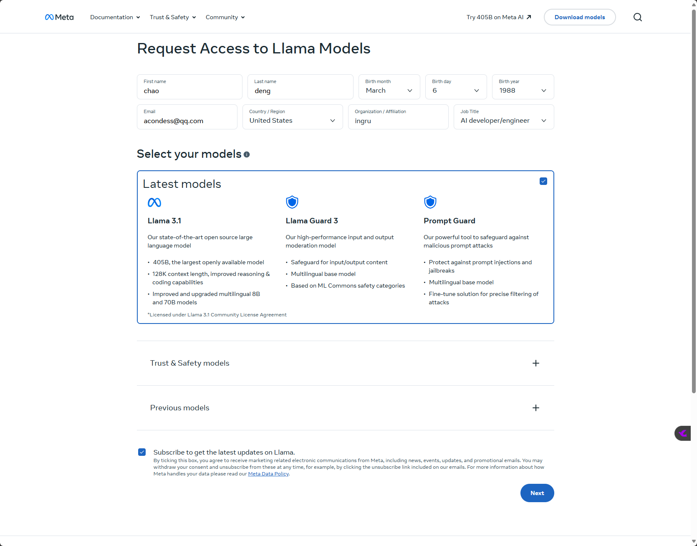

  - 许可勾选
    
    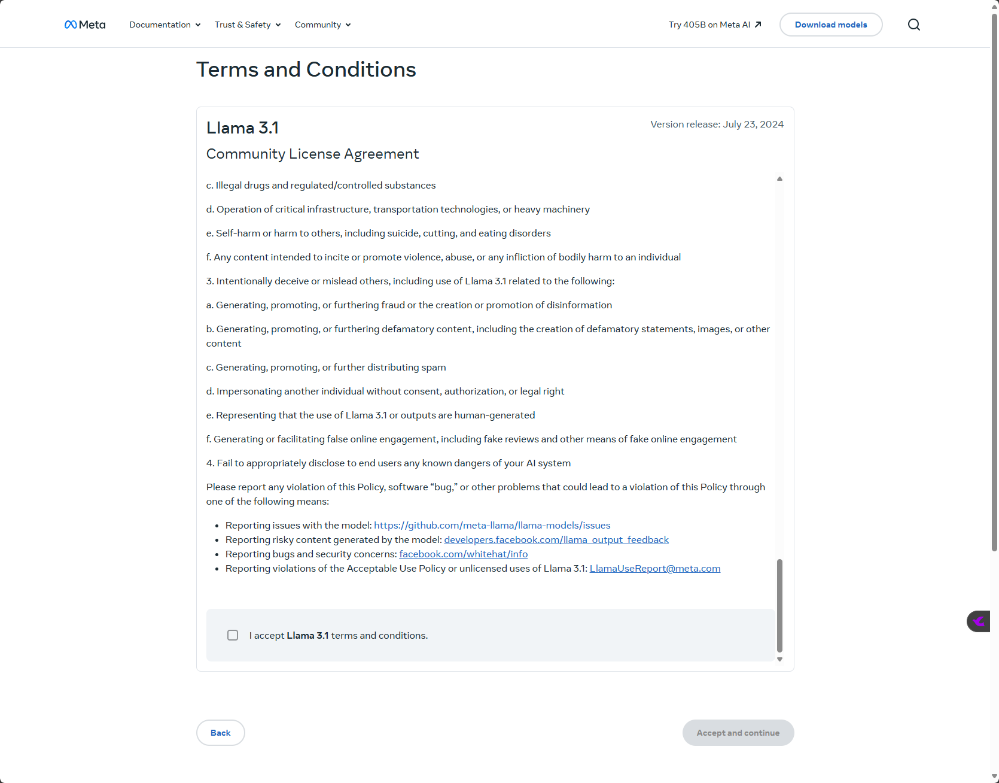

  - 获取到验证URL地址(24小时有效)

    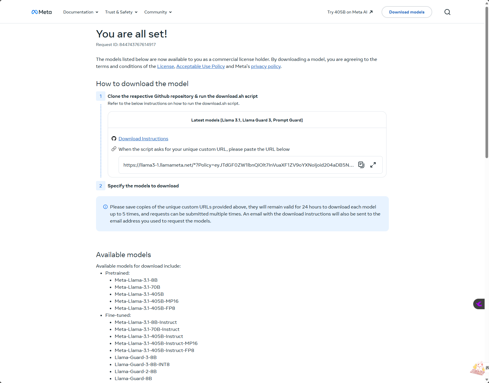

### 2.2. 源码下载

  - Step1 获取源码 

    [github地址](https://github.com/meta-llama/llama-models/tree/main)

    ``` git clone https://github.com/meta-llama/llama-models.git```

  - Step2 运行download.sh脚本

    ``` bash ./download.sh```

    - 注意使用bash 执行 download.sh 

        [issue](https://github.com/meta-llama/llama/issues/476)

  - Step3 模型下载-输入验证URL地址

    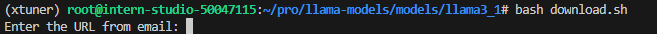

    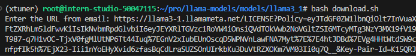

  - Step4 模型下载-选择模型

     -  meta-llama-3.1-405b
     -  meta-llama-3.1-70b
     -  meta-llama-3.1-8b
     -  meta-llama-guard-3-8b
     -  prompt-guard

    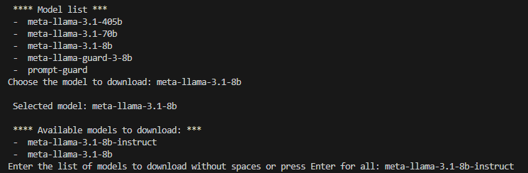

    - 需要科学上网

    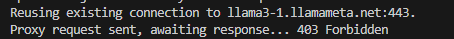

  - Step5 模型下载-模型文件夹结构

    ```
        ── api
        │?? ├── args.py
        │?? ├── chat_format.py
        │?? ├── datatypes.py
        │?? ├── __init__.py
        │?? ├── interface.py
        │?? ├── model.py
        │?? ├── sku_list.py
        │?? ├── templates
        │?? │?? ├── assistant_message.builtin_tool_call.yaml
        │?? │?? ├── assistant_message.custom_tool_call.yaml
        │?? │?? ├── assistant_message.default.yaml
        │?? │?? ├── assistant_message.jinja
        │?? │?? ├── system_message.builtin_and_custom_tools.yaml
        │?? │?? ├── system_message.builtin_tools_only.yaml
        │?? │?? ├── system_message.custom_tools_only.yaml
        │?? │?? ├── system_message.default.yaml
        │?? │?? ├── system_message.jinja
        │?? │?? ├── tool_message.failure.yaml
        │?? │?? ├── tool_message.jinja
        │?? │?? ├── tool_message.success.yaml
        │?? │?? ├── user_message.default.yaml
        │?? │?? └── user_message.jinja
        │?? ├── test_tokenizer.py
        │?? ├── tokenizer.model
        │?? ├── tokenizer.py
        │?? └── tool_utils.py
        ├── download.sh
        ├── eval_details.md
        ├── __init__.py
        ├── LICENSE
        ├── Meta-Llama-3.1-405B-Instruct-MP16
        │?? ├── consolidated.00.pth
        │?? ├── consolidated.01.pth
        │?? ├── consolidated.02.pth
        │?? ├── consolidated.03.pth
        │?? └── tokenizer.model
        ├── MODEL_CARD.md
        ├── README.md
        ├── requirements.txt
        └── USE_POLICY.md
    ```

### 2.3. HF下载

  > [HF 合集地址](https://huggingface.co/collections/meta-llama/llama-31-669fc079a0c406a149a5738f)

  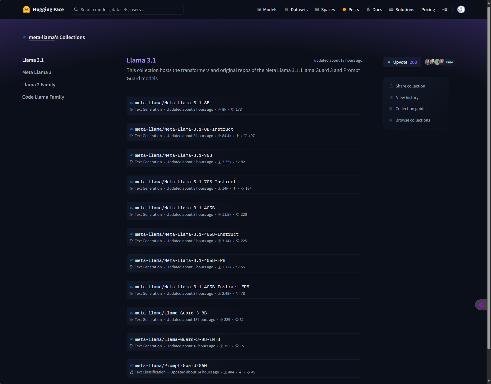

  - Step1 许可信息填写

  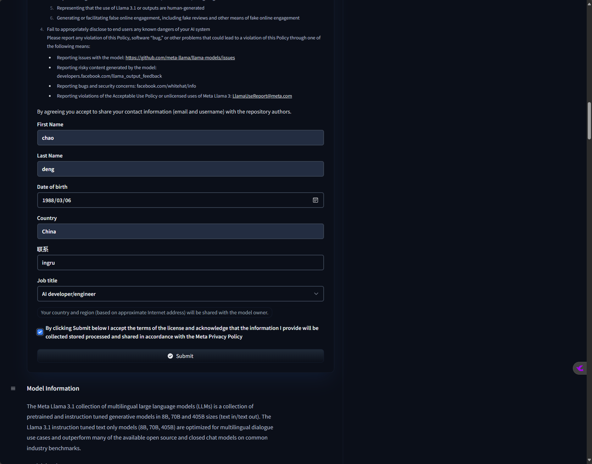

  - 等待许可通过

  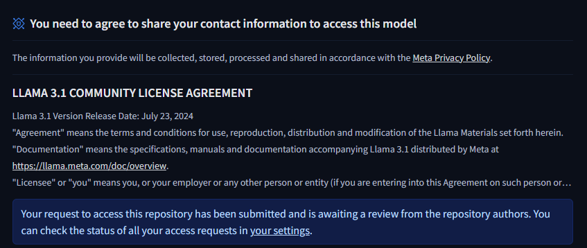

### 2.4 ollama 下载

  > [ollma llama3.1 地址](https://ollama.com/library/llama3.1)

   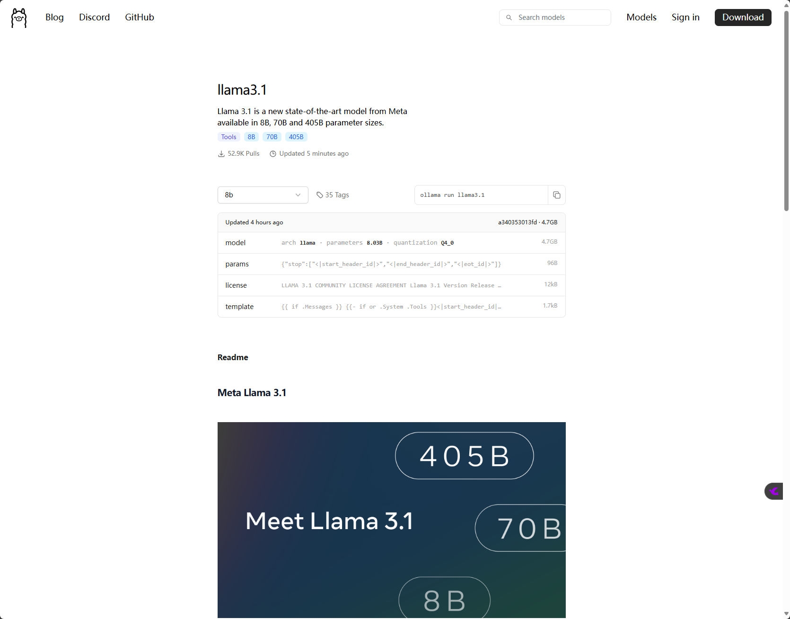


## 三、快速体验

### 3.1 应用快速体验

  [Try 405B on Meta AI](https://www.meta.ai/?utm_source=llama_meta_site&utm_medium=web&utm_content=Llama_nav&utm_campaign=July_moment)

### 3.2 模型快速体验

#### 3.2.1 ollama 本地运行量化llama3.1模型

  - 选取量化模型

    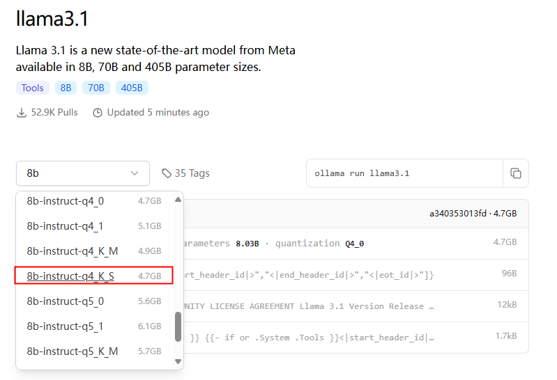

  - 复制对应量化模型的命令

    ``` ollama run llama3.1:8b-instruct-q4_K_S ```

    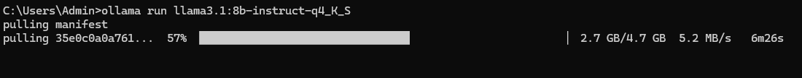

    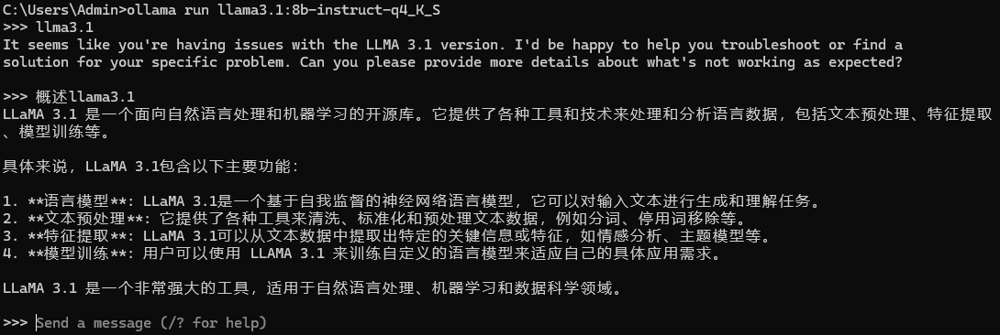

  

## 四、微调

## 五、量化

## 六、部署及应用

### 魔搭

  - [llama3.1 405B体验页面](https://www.modelscope.cn/studios/LLM-Research/Meta-Llama-3.1-405B-Instruct-FP8-demo)

  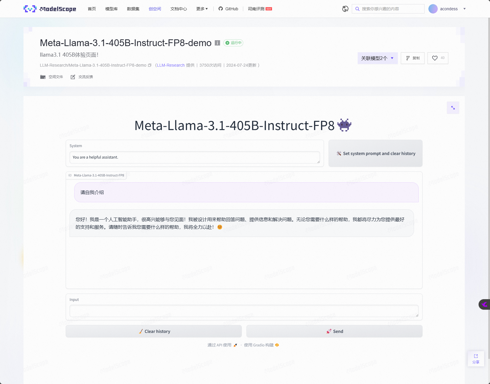

  - 源码：

    ``` git clone https://www.modelscope.cn/studios/LLM-Research/Meta-Llama-3.1-405B-Instruct-FP8-demo.git ```

## 七、论文解读

> 链接地址  [the-llama-3-herd-of-models](https://ai.meta.com/research/publications/the-llama-3-herd-of-models/)

>源文件  [The Llama 3 Herd of Models.pdf](<../../pdfs/The Llama 3 Herd of Models.pdf>)

>博客  [Introducing Llama 3.1: Our most capable models to date](https://ai.meta.com/blog/meta-llama-3-1/)

### 7.1 论文摘要

    > Modern artificial intelligence (AI) systems are powered by foundation models. This paper presents a new set of foundation models, called Llama 3. It is a herd of language models that natively support multilinguality, coding, reasoning, and tool usage. Our largest model is a dense Transformer with 405B parameters and a context window of up to 128K tokens. This paper presents an extensive empirical evaluation of Llama 3. We find that Llama 3 delivers comparable quality to leading language models such as GPT-4 on a plethora of tasks. We publicly release Llama 3, including pre-trained and post-trained versions of the 405B parameter language model and our Llama Guard 3 model for input and output safety. The paper also presents the results of experiments in which we integrate image, video, and speech capabilities into Llama 3 via a compositional approach. We observe this approach performs competitively with the state-of-the-art on image, video, and speech recognition tasks. The resulting models are not yet being broadly released as they are still under development.

    >现代人工智能 (AI) 系统由基础模型驱动。本文介绍了一组新的基础模型，称为 Llama 3。这是一群原生支持多语言、编码、推理和工具使用的语言模型。我们最大的模型是一个具有 4050 亿个参数和最多 128K 个标记的上下文窗口的密集 Transformer。本文对 Llama 3 进行了广泛的实证评估。我们发现 Llama 3 在大量任务上提供与 GPT-4 等领先语言模型相当的质量。我们公开发布了 Llama 3，包括 4050 亿参数语言模型的预训练和后训练版本，以及我们的 Llama Guard 3 模型，用于输入和输出安全。本文还介绍了将图像、视频和语音功能通过组合方法集成到 Llama 3 中的实验结果。我们观察到这种方法在图像、视频和语音识别任务上与最先进的技术竞争。由于这些模型仍在开发中，因此尚未广泛发布。

    > AI总结：Meta AI 近日发布了一系列名为 Llama 3 的基础模型，这些模型是语言模型的集合，能够原生支持多语言、编码、推理和工具使用。Llama 3 中最大的模型是一个拥有 4050 亿参数的密集 Transformer，上下文窗口高达 128K 个 token。
    论文对 Llama 3 进行了广泛的实证评估，发现它在众多任务上的表现与 GPT-4 等领先的语言模型相当。Meta 公开发布了 Llama 3，包括 4050 亿参数语言模型的预训练和后训练版本，以及用于输入和输出安全的 Llama Guard 3 模型。
    论文还展示了通过组合方法将图像、视频和语音功能整合到 Llama 3 中的实验结果。实验表明，这种方法在图像、视频和语音识别任务上的表现与最先进技术相当。但由于这些模型仍在开发中，尚未广泛发布。
    Llama 3 的发布是 Meta 在人工智能领域的一项重大进展，标志着大型语言模型在多语言、编码、推理和工具使用等方面的能力正在不断提升。未来，Meta 将继续探索和开发人工智能技术的应用，为人类社会创造更多价值。

### 7.2 llama3介绍总结
    AI总结：
    >  Meta发布了迄今为止最强大的开源模型Llama 3.1，其405B版本在能力上媲美最先进的闭源模型，标志着开源大语言模型进入了一个新时代。
    
    >Llama 3.1 405B 在通用知识、可控性、数学、工具使用和多语言翻译方面都取得了显著进步。它可以用于各种应用场景，例如合成数据生成，模型蒸馏，长篇文本摘要，多语言对话代理和编码助手。
    
    >Llama 3.1 405B 是第一个在规模和能力上与 GPT-4 等闭源模型相媲美的开源模型。该模型在超过 15 万亿个标记上训练，使用了超过 16000 个 H100 GPU。为了提高模型的训练效率和稳定性，Meta 采用了标准的解码器-只 transformer 模型架构，并进行了迭代式后训练过程，包括监督微调和直接偏好优化。
    
    >Meta 还发布了 Llama 3.1 8B 和 70B 版本，它们支持多语言，上下文长度扩展到 128K，并具有更强大的推理能力。此外，Meta 还推出了 Llama Guard 3 和 Prompt Guard 等安全工具，以确保模型的负责任使用。
    
    >Meta 致力于打造一个完整的 Llama 系统，该系统包括多个组件，例如外部工具调用，安全模型和提示注入过滤器。Meta 还发布了 Llama Stack API 的请求意见，希望能够为第三方项目提供一个标准接口，以便更容易地利用 Llama 模型。
    M
    >eta 相信 Llama 3.1 的发布将推动开源社区的创新，并为开发者提供更多工具来构建新的应用。Meta 期待看到社区利用 Llama 3.1 构建更多有用的产品和体验。