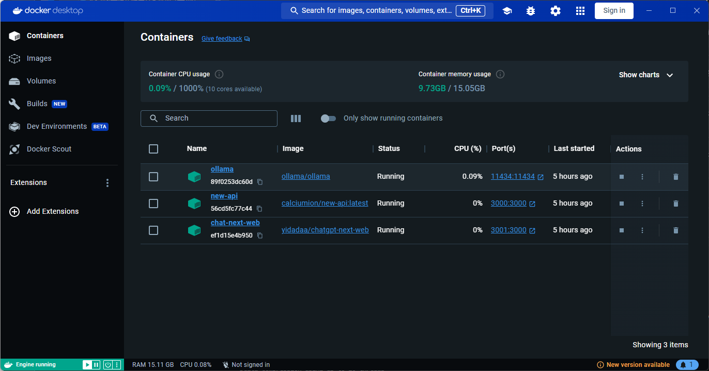
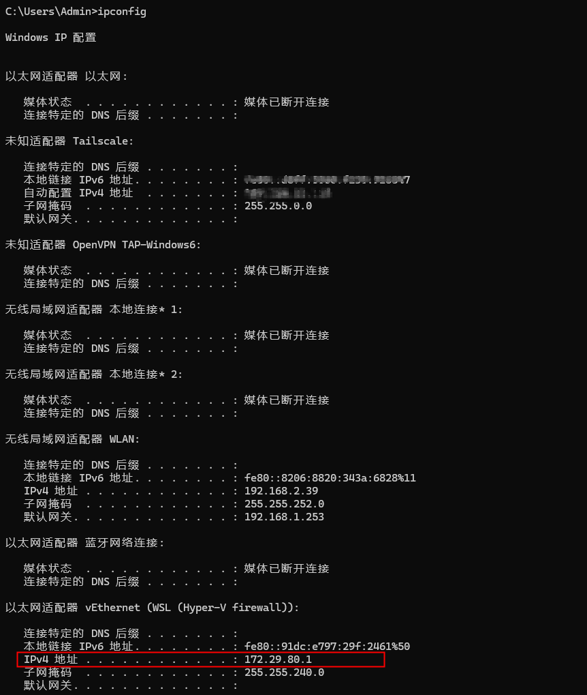
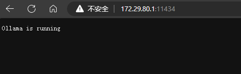
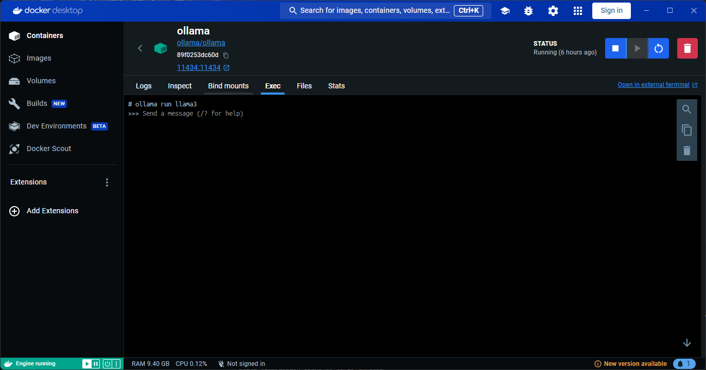

# 4.3 AGI一站式解决方案本地部署

## 一、功能
   
   利用开源项目快速本地部署AGI一站式解决方案。
   
   - 零门槛
     - 无硬件资源要求
     - 无技术背景要求
     - 无代码编写要求

## 二、架构

---
    前端web应用层——WebUI NextWeb
---
    服务后端管理层——New API(one API)
---
    本地部署大模型层——LLM Ollama
---
    本地部署基础环境层——Windoes wsl2 docker
---

## 三、环境搭建

### 3.1 Windows安装wsl2

### 3.2 Windows安装docker desktop

## 四、部署步骤



### 4.1 Ollama docker部署
 
 - win 终端输入命令 

  ``` docker run -d -v ollama:/root/.ollama -p 11434:11434 --name ollama ollama/ollama ```

- docker wsl IP访问地址

  ``` ipconfig ```

  
  
  http://172.29.80.1:11434/

  

- ollama容器内获取llama3大模型

  ``` ollma run llama3 ```

  

## 五、扩展应用

- 部署其他大模型
- 部署其他webui

## 六、其他一站式解决方案

- [quivr](https://github.com/QuivrHQ/quivr) (知识库)
- [chat Nio](https://github.com/Deeptrain-Community/chatnio/blob/main/README_zh-CN.md) （一站式解决方案）
- [FastGPT @labring](https://github.com/labring/FastGPT) （知识库）
- [Quivr @quivrhq](https://github.com/StanGirard/quivr) （知识库）
- [Bingo @weaigc](https://github.com/weaigc/bingo) （模型库）
- [Midjourney Proxy @novicezk](https://github.com/novicezk/midjourney-proxy) （模型库）
- [phidata ollama](https://github.com/Deeptrain-Community/chatnio/blob/main/README_zh-CN.md) （一站式解决方案）
- [Dify ollama](https://docs.dify.ai/v/zh-hans/guides/model-configuration/ollama) （一站式解决方案）

## 七、 参考
