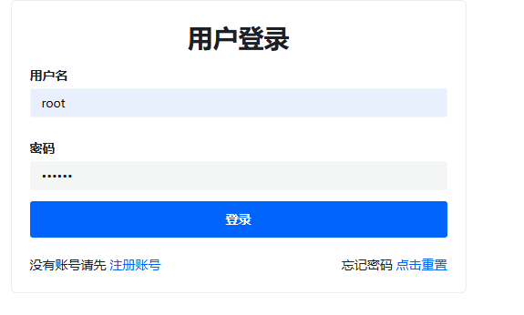
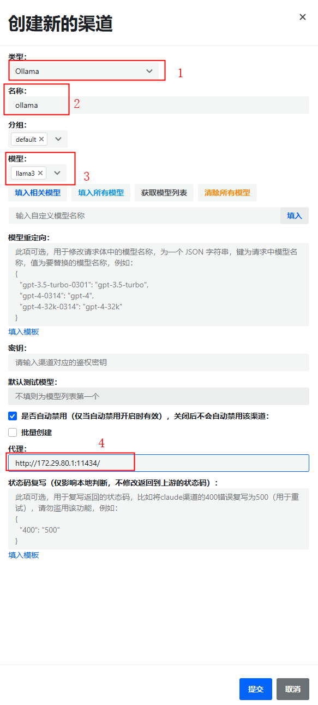
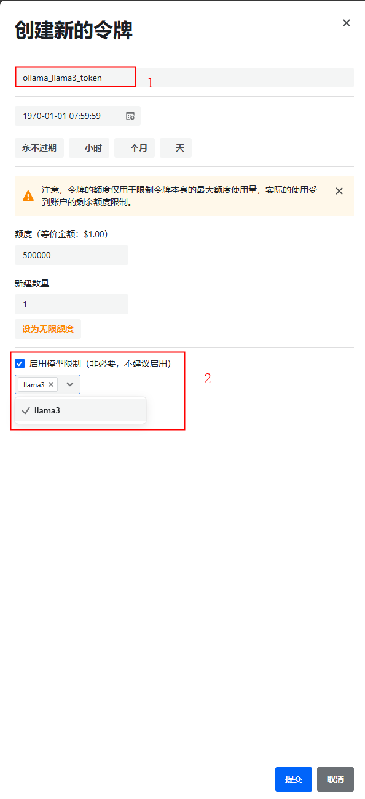
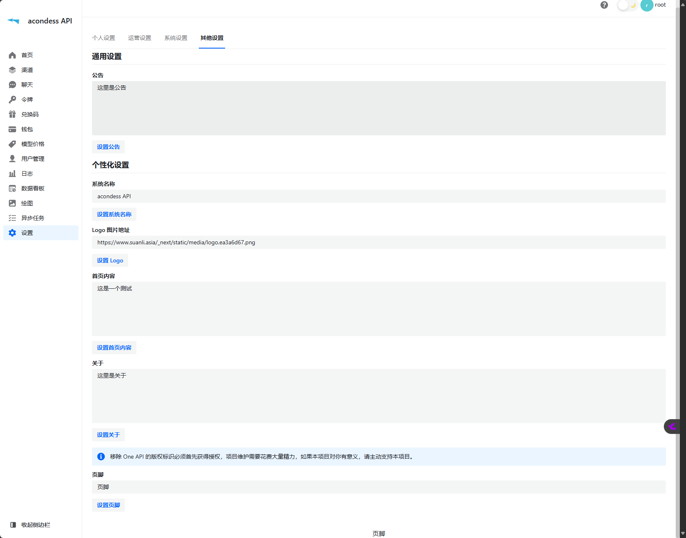

# 4.3 AGI一站式解决方案本地部署

## 一、功能
   
   利用开源项目快速本地部署AGI一站式解决方案。
   
   - 零门槛
     - 无硬件资源要求
     - 无技术背景要求
     - 无代码编写要求

## 二、架构

---
    前端web应用层——WebUI NextWeb
---
    服务后端管理层——New API(one API)
---
    本地部署大模型层——LLM Ollama
---
    本地部署基础环境层——Windoes wsl2 docker
---

## 三、环境搭建

### 3.1 Windows安装wsl2

### 3.2 Windows安装docker desktop

## 四、部署步骤


### 4.1 Ollama docker部署
 
 - win 终端输入命令 

  ``` docker run -d -v ollama:/root/.ollama -p 11434:11434 --name ollama ollama/ollama ```

- docker wsl IP访问地址

  ``` ipconfig ```

  
  
  http://172.29.80.1:11434/

  

- ollama容器内获取llama3大模型

  ``` ollma run llama3 ```

  

### 4.2 New API部署

- win 终端输入命令

  ``` docker run --name new-api -d --restart always -p 3000:3000 -e TZ=Asia/Shanghai -v /home/ubuntu/data/new-api:/data calciumion/new-api:latest ```

- 本地访问地址

  http://172.29.80.1:3000/

### 4.3 New API配置

- 默认用户名密码登录

  ``` root 123456 ```

  

- ollama渠道配置（秘钥为必填内容，因为本地部署大模型，固可随意填写）
    1. 选择类型为ollama
    2. 输入渠道名称为ollama（可以为其他）
    3. 清除所有模型后，输入自定义模型llama3并点击填入
    4. 输入代理地址为 ``` http://172.29.80.1:11434/ ```
    5. 点击提交
    
    6. 点击测试
    

- 配置令牌
    1. 输入令牌名
    2. 设置对应模型为llama3
    
    
    后续配置完Next Web项目后可进行对话验证。

- 低代码界面设置
    1. 公告
    2. 系统名
    3. logo图片
    4. 首页内容
    5. 关于
    6. 页脚
    
    

## 五、扩展应用

- 部署其他大模型
- 部署其他webui

### 5.1 部署RAGFlow

```shell 
git clone https://github.com/infiniflow/ragflow.git
cd ragflow/docker
docker compose -f docker-compose-CN.yml up -d
docker logs -f ragflow-server
```

- 本地访问RAGFlow `http://localhost:80`

### 5.2 部署GraphRAG


## 六、其他一站式解决方案

- [quivr](https://github.com/QuivrHQ/quivr) (知识库)
- [chat Nio](https://github.com/Deeptrain-Community/chatnio/blob/main/README_zh-CN.md) （一站式解决方案）
- [FastGPT @labring](https://github.com/labring/FastGPT) （知识库）
- [Quivr @quivrhq](https://github.com/StanGirard/quivr) （知识库）
- [Bingo @weaigc](https://github.com/weaigc/bingo) （模型库）
- [Midjourney Proxy @novicezk](https://github.com/novicezk/midjourney-proxy) （模型库）
- [phidata ollama](https://github.com/Deeptrain-Community/chatnio/blob/main/README_zh-CN.md) （一站式解决方案）
- [Dify ollama](https://docs.dify.ai/v/zh-hans/guides/model-configuration/ollama) （一站式解决方案）

## 七、 参考

https://mp.weixin.qq.com/s/F8M6WjuisJJ-wWgWtpwtAg

https://mp.weixin.qq.com/s/Qu7Poyu7hhsKgMHWCLL5RQ