# 1.1 Linux 基础知识

## 一、任务说明

闯关任务需要在关键步骤中截图：

|            | 任务描述                                      | 完成所需时间 |
| ---------- | --------------------------------------------- | ------------ |
| 闯关任务   | 完成SSH连接与端口映射并运行`hello_world.py`   | 10min        |
| 可选任务 1 | 将Linux基础命令在开发机上完成一遍             | 10min        |
| 可选任务 2 | 使用 VSCODE 远程连接开发机并创建一个conda环境 | 10min        |
| 可选任务 3 | 创建并运行`test.sh`文件                       | 10min        |

- [文档地址](https://github.com/InternLM/Tutorial/blob/camp3/docs/L0/Linux/readme.md)

## 二、闯关任务

- 任务说明：```bash 完成SSH连接与端口映射并运行hello_world.py```
- 结果截图
    - SSH连接与端口映射
    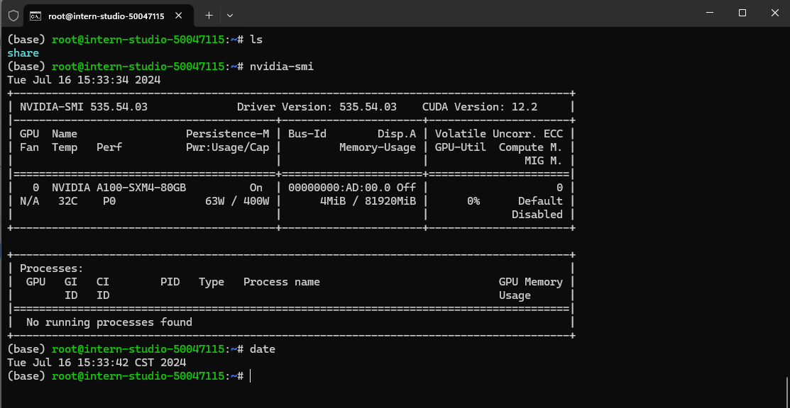
    - 运行hello_world.py
    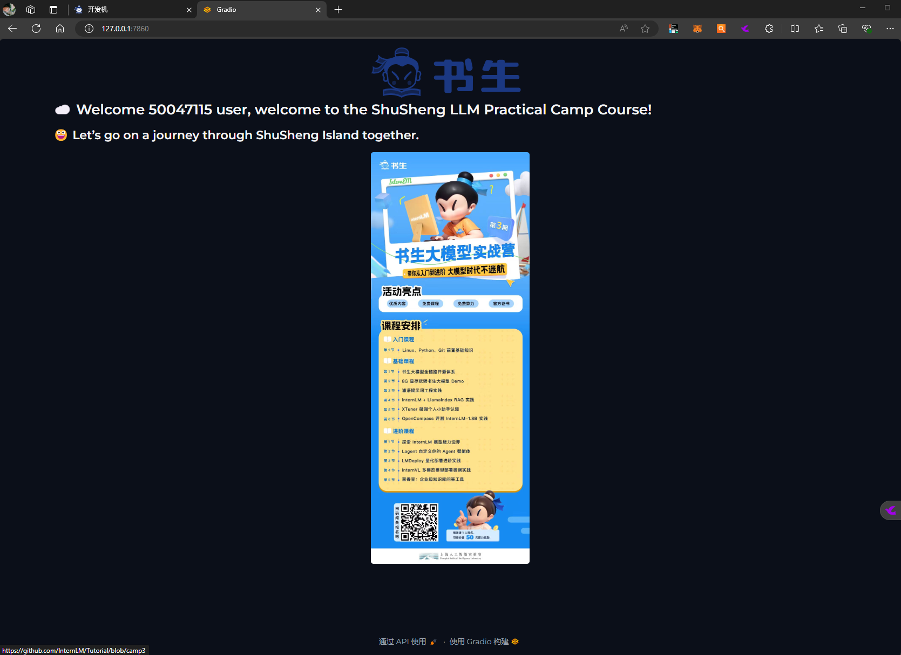

### ① SSH连接与端口映射

#### 步骤

- 进入InternStudio平台

    - [InternStudio地址](https://studio.intern-ai.org.cn/)
      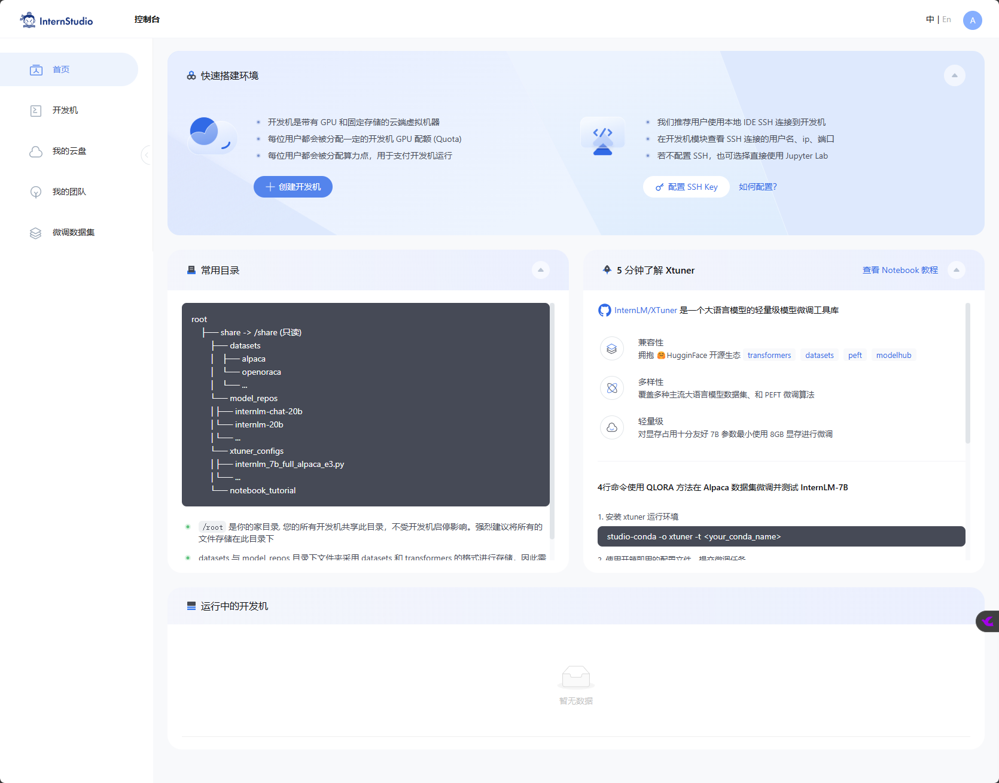

- 创建开发机

    - 1.点选左侧菜单栏“开发机”
    - 2.命名开发机
    - 3.点击选择镜像
    - 4.选择镜像并使用
    - 5.选择资源配置
    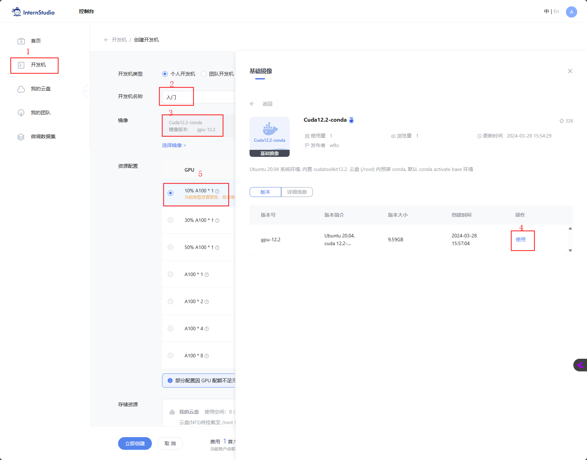

- SSH连接
    - 创建ssh秘钥
        - 1.命令行输入 ```bash ssh-keygen -t rsa```
        - 2.系统用户.ssh文件下找到id_rsa.pub
        - 3.打开id_rsa.pub获取秘钥
    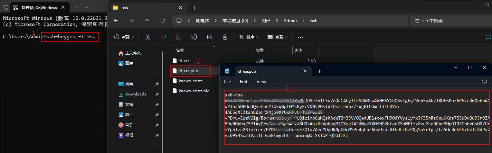
    - 平台添加ssh秘钥
        - 右上角头像下拉点选“访问管理”
        - 点击“添加SSH公钥”
        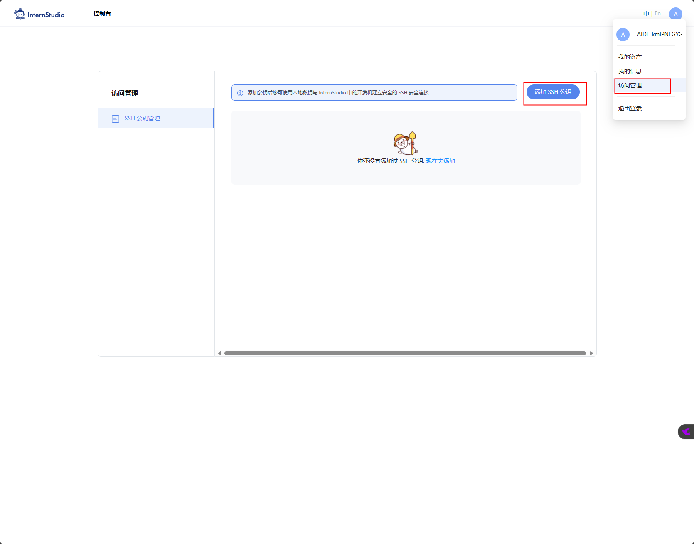
        - 粘贴公钥
        - 命名后点击添加
        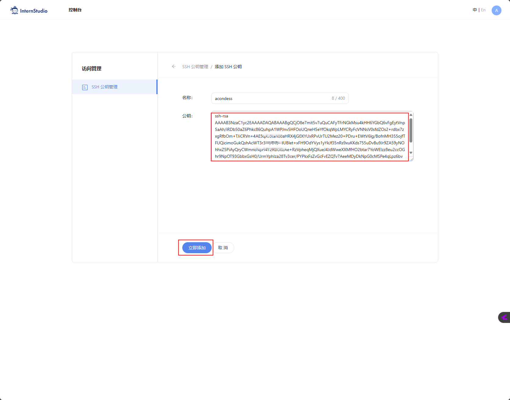
    - 免密登录
        - 点击创建的开发机“SSH连接”
        - 点击登录命令“复制”
        - 打开命令终端粘贴登录命令
    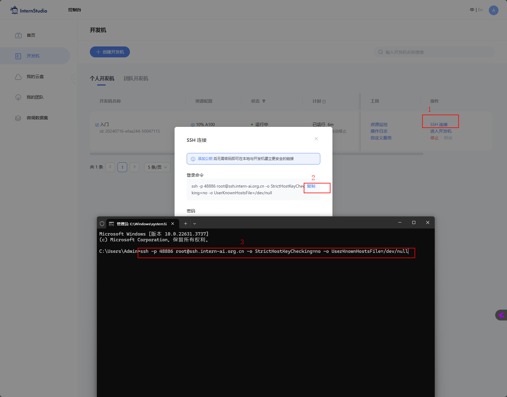
    - 登录成功
    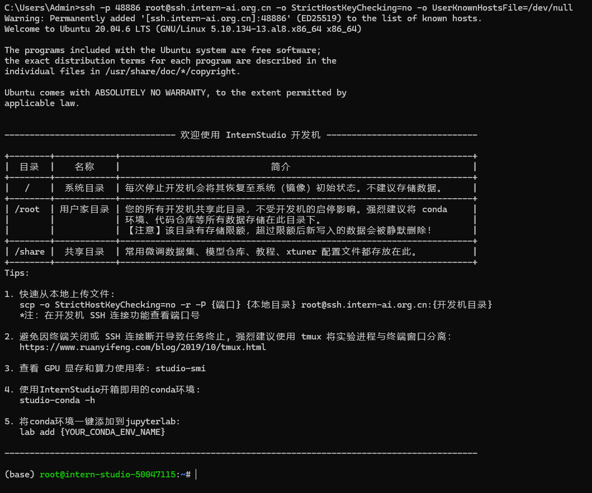

        


### ② 运行hello_world.py

#### 步骤

- 进入开发机vscode
    - 点击创建的开发机"进入开发机“
    - 切换顶部tab进入vscode
    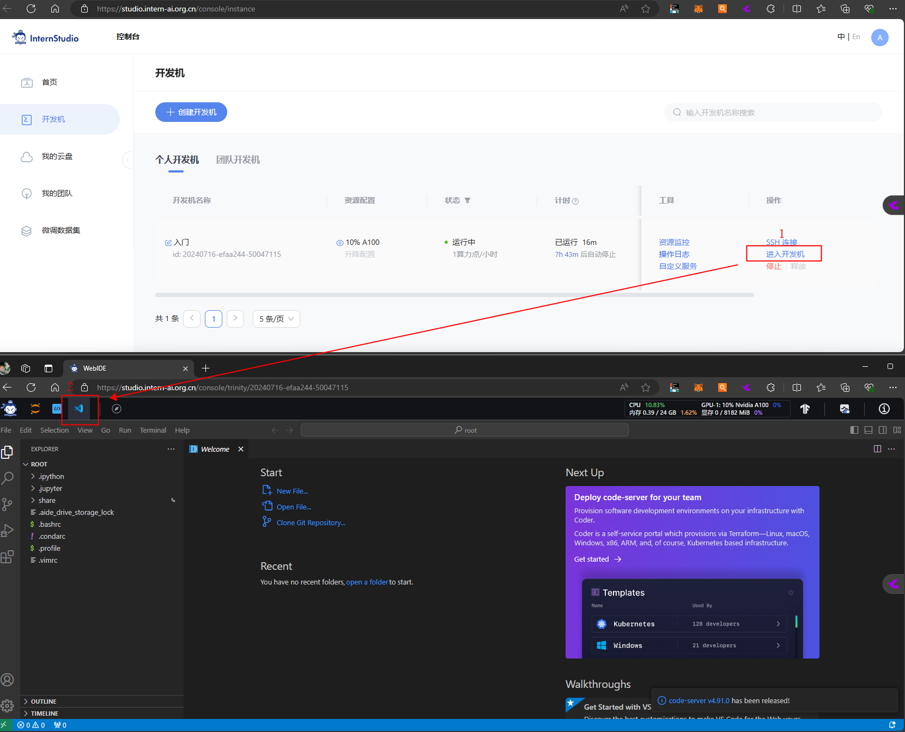

- 创建hello_world.py文件
    - ROOT文件夹下创建pro文件夹
    - pro文件夹下创建hello_world.py文件
    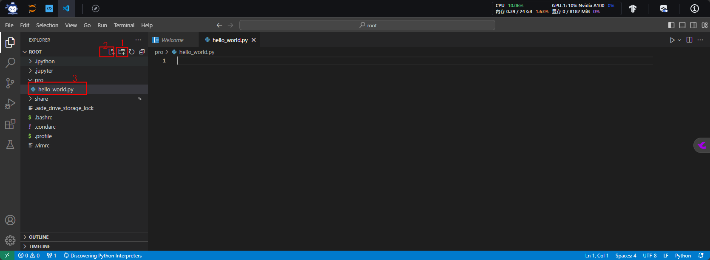

- 编写hello_world.py文件
```Python linenums="1"
import socket
import re
import gradio as gr
 
# 获取主机名
def get_hostname():
    hostname = socket.gethostname()
    match = re.search(r'-(\d+)$', hostname)
    name = match.group(1)
    
    return name
 
# 创建 Gradio 界面
with gr.Blocks(gr.themes.Soft()) as demo:
    html_code = f"""
            <p align="center">
            <a href="https://intern-ai.org.cn/home">
                
            </a>
            </p>
            <h1 style="text-align: center;">☁️ Welcome {get_hostname()} user, welcome to the ShuSheng LLM Practical Camp Course!</h1>
            <h2 style="text-align: center;">😀 Let’s go on a journey through ShuSheng Island together.</h2>
            <p align="center">
                <a href="https://github.com/InternLM/Tutorial/blob/camp3">
                    
                </a>
            </p>

            """
    gr.Markdown(html_code)

demo.launch()
```
- 安装gradio依赖包 ```bash pip install gradio==4.29.0```
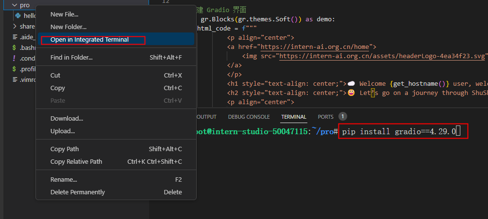

- 运行hello_world.py文件 ``` python hello_world.py ```
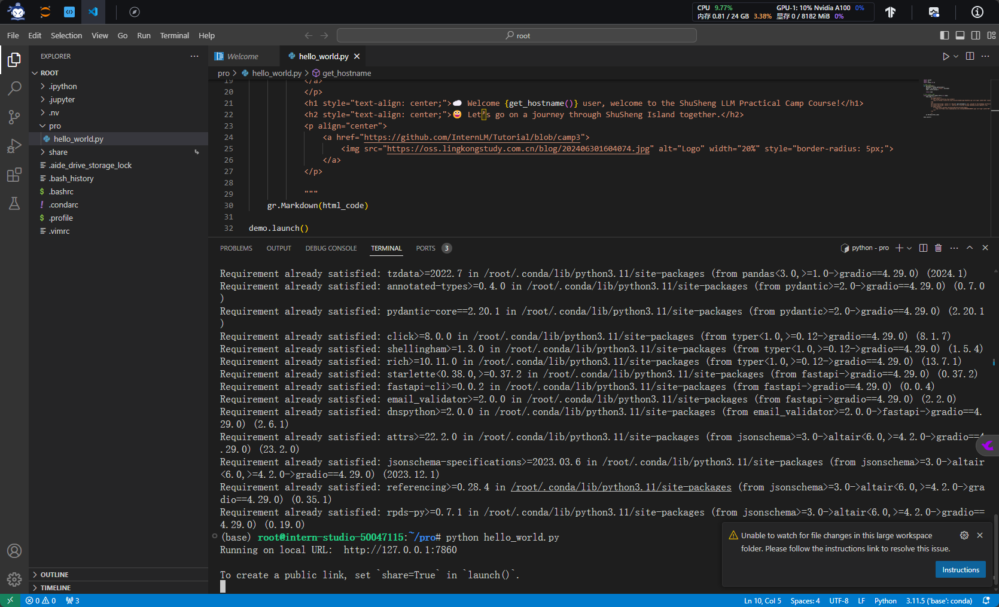

- 本地浏览
    - 本地端口映射 
        - 本地命令行输入 ：```bash ssh -p 48886 root@ssh.intern-ai.org.cn -CNg -L 7860:127.0.0.1:7860 -o StrictHostKeyChecking=no```
        - **注意** ：替换端口为自己端口号
    - 访问 ```http://127.0.0.1:7860/```
    

## 可选任务

### ① Linux基础命令

#### 文件管理

- **创建文件**：可以使用 `touch` 命令创建空文件。
- **创建目录**：使用 `mkdir` 命令。
- **目录切换**：使用`cd`命令。
- **显示所在目录**：使用`pwd`命令。
- **查看文件内容**：如使用 `cat` 直接显示文件全部内容，`more` 和 `less` 可以分页查看。
- **编辑文件**：如 `vi` 或 `vim` 等编辑器。
- **复制文件**：用 `cp` 命令。
- **创建文件链接**：用`ln`命令。
- **移动文件**：通过 `mv` 命令。
- **删除文件**：使用 `rm` 命令。
- **删除目录**：`rmdir`（只能删除空目录）或 `rm -r`（可删除非空目录）。
- **查找文件**：可以用 `find` 命令。
- **查看文件或目录的详细信息**：使用`ls`命令，如使用 `ls -l`查看目录下文件的详细信息。
- **处理文件**：进行复杂的文件操作，可以使用`sed`命令。

#### 进程管理

**进程管理**命令是进行系统监控和进程管理时的重要工具，常用的进程管理命令有以下几种：

- **ps**：查看正在运行的进程
- **top**：动态显示正在运行的进程
- **pstree**：树状查看正在运行的进程
- **pgrep**：用于查找进程
- **nice**：更改进程的优先级
- **jobs**：显示进程的相关信息
- **bg 和 fg**：将进程调入后台
- **kill**：杀死进程

```bash nvidia-smi```


### ② VSCODE 远程连接开发机并创建一个conda环境

#### 使用VScode进行ssh远程连接

- Remote-SSH插件
    - 1.打开扩展面板
    - 2.搜索Remote-SSH插件
    - 3.安装
    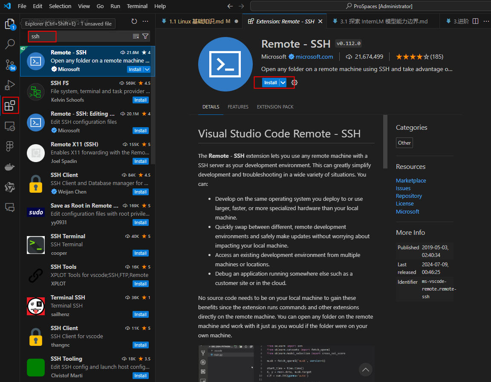

- ssh远程连接
    - 1.打开命令面板
    - 2.输入ssh命令
    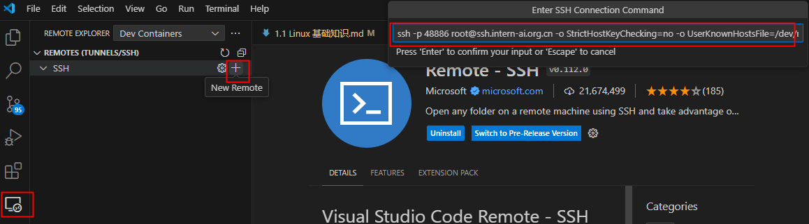
    - 点击connet连接主机
    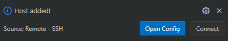
    - 报错
    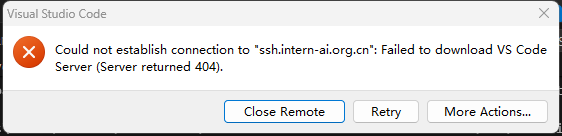


### ③ 创建并运行`test.sh`文件

```bash 
cd pro/
touch test.sh
vim test.sh
nvidia-smi
sh test.sh
```

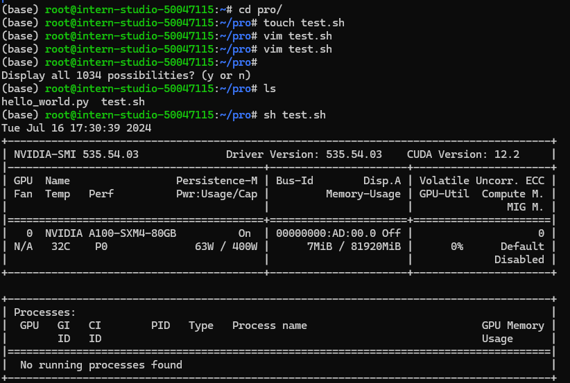
