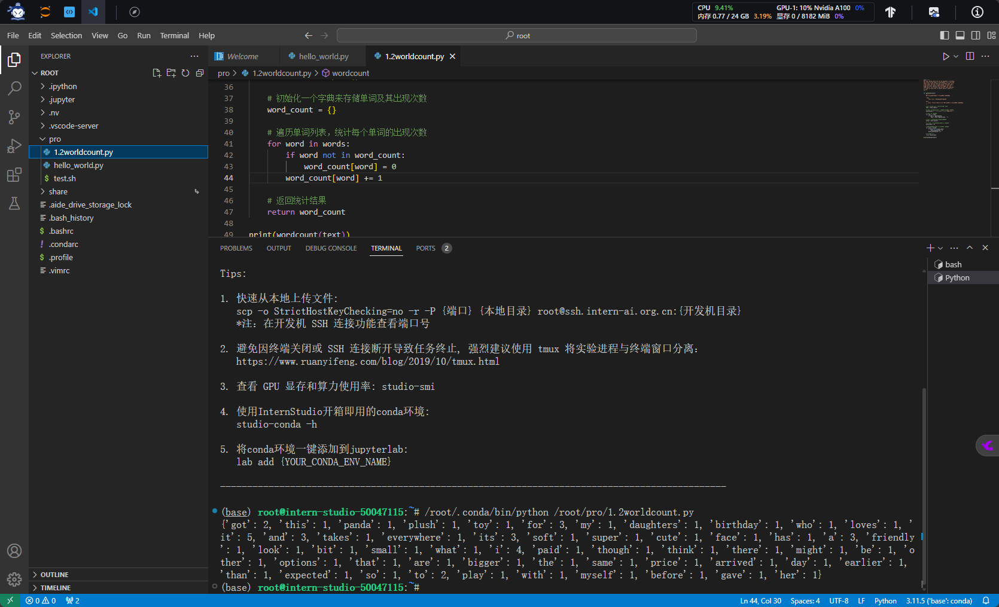

# 1.2 Python 基础知识

## 一、任务说明

| 任务类型 | 任务内容 | 预计耗时 |
| --- |---| ---|
|闯关任务|Python实现wordcount| 15mins|
|闯关任务|Vscode连接InternStudio debug笔记| 15mins|

### 1.wordcount 任务

请实现一个wordcount函数，统计英文字符串中每个单词出现的次数。返回一个字典，key为单词，value为对应单词出现的次数。

Eg:

Input:

```python
"""Hello world!  
This is an example.  
Word count is fun.  
Is it fun to count words?  
Yes, it is fun!"""
```

Output:

```python
{'hello': 1,'world!': 1,'this': 1,'is': 3,'an': 1,'example': 1,'word': 1, 
'count': 2,'fun': 1,'Is': 1,'it': 2,'to': 1,'words': 1,'Yes': 1,'fun': 1  }
```

TIPS：记得先去掉标点符号,然后把每个单词转换成小写。不需要考虑特别多的标点符号，只需要考虑实例输入中存在的就可以。

```python
text = """
Got this panda plush toy for my daughter's birthday,
who loves it and takes it everywhere. It's soft and
super cute, and its face has a friendly look. It's
a bit small for what I paid though. I think there
might be other options that are bigger for the
same price. It arrived a day earlier than expected,
so I got to play with it myself before I gave it
to her.
"""

def wordcount(text):
    pass


```

### 2.Vscode连接InternStudio debug 任务

请使用本地vscode连接远程开发机，将上面你写的wordcount函数在开发机上进行debug，体验debug的全流程，并完成一份debug笔记(需要截图)。


## 二、任务提交

### wordcount结果提交


### debug任务提交

## 三、任务步骤

### wordcount

```python linenums="1"
text = """
Got this panda plush toy for my daughter's birthday,
who loves it and takes it everywhere. It's soft and
super cute, and its face has a friendly look. It's
a bit small for what I paid though. I think there
might be other options that are bigger for the
same price. It arrived a day earlier than expected,
so I got to play with it myself before I gave it
to her.
"""

def wordcount(text):
    """
    统计给定英文字符串中每个单词的出现次数。

    参数:
        text (str): 输入的英文字符串。

    返回:
        dict: 字典类型的结果，其中键是单词，值是该单词的出现次数。
    """

    # 将所有字符转换为小写，以便统一处理
    text = text.lower()

    # 定义一个字符串，包含所有需要被移除的标点符号
    punctuation = '''!()-[]{};:'"\,<>./?@#$%^&*_~'''

    # 移除所有标点符号
    for char in text:
        if char in punctuation:
            text = text.replace(char, "")

    # 根据空格分割字符串，得到单词列表
    words = text.split()

    # 初始化一个字典来存储单词及其出现次数
    word_count = {}

    # 遍历单词列表，统计每个单词的出现次数
    for word in words:
        if word not in word_count:
            word_count[word] = 0
        word_count[word] += 1

    # 返回统计结果
    return word_count

print(wordcount(text))
```