# 1.3 Git基础

## 一、任务说明

- **任务1**: 破冰活动：自我介绍
    - 1. 命名格式为 `camp3_<id>.md`，其中 `<id>` 是您的报名问卷ID。
    - 2. 文件路径应为 `./data/Git/task/`。
    - 3. 【大家可以叫我】内容可以是 GitHub 昵称、微信昵称或其他网名。
    - 4. 在 GitHub 上创建一个 Pull Request，提供对应的 PR 链接。
- **任务2**: 实践项目：构建个人项目
    - 1. 创建并维护一个公开的大模型相关项目或笔记仓库。
    - 2. 提交作业时，提供您的 GitHub 仓库链接。
    - 3. 如果您不常使用 GitHub，您可以选择其他代码管理平台，如 Gitee，并提交相应的链接。
    - 4. 仓库介绍中添加超链接跳转 [GitHub 仓库](https://github.com/InternLM/Tutorial)（<u>[https://github.com/InternLM/Tutorial](https://github.com/InternLM/Tutorial)</u>）
    - 5. 将此项目报名参加第三期实战营项目评选将解锁 30% A100 和 168 团队算力点资源，报名链接：[https://aicarrier.feishu.cn/wiki/DjY6whCO0inTu2kQN9Cchxgynme](https://aicarrier.feishu.cn/wiki/DjY6whCO0inTu2kQN9Cchxgynme)

## 二、任务提交
- PR自我介绍
    - 合并请求PR链接：https://github.com/InternLM/Tutorial/pull/1044
    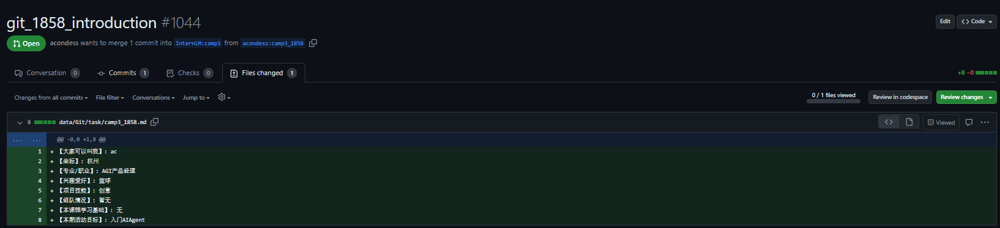

- 实践项目
    - 项目地址：https://github.com/acondess/menke
    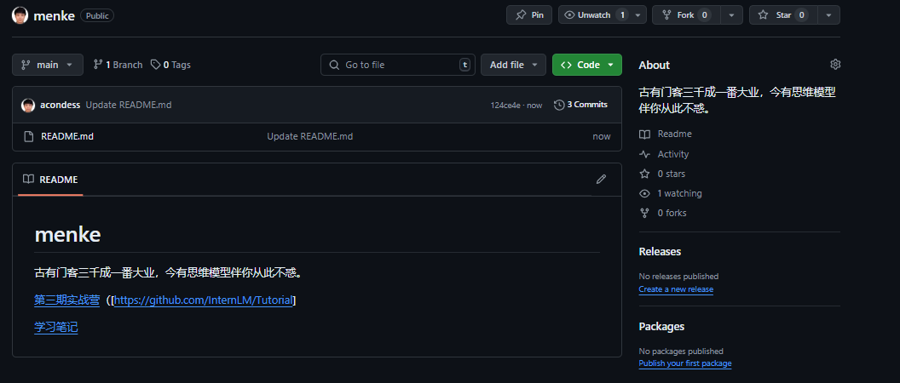

## 三、任务实现步骤

###  Pull Request自我介绍

- fork 仓库 [https://github.com/InternLM/Tutorial](https://github.com/InternLM/Tutorial)
- clone fork 仓库到开发机 `git clone https://github.com/acondess/Tutorial.git`
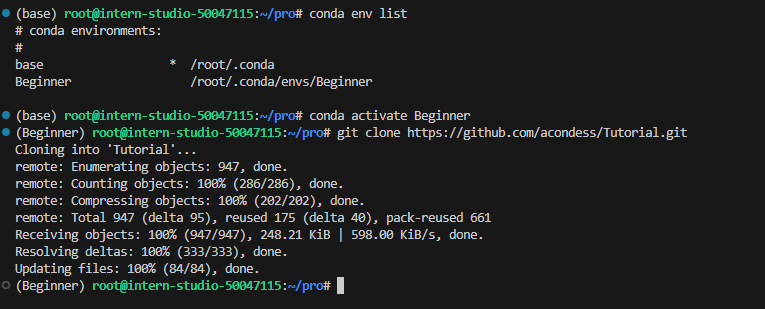
- 查看分支 `git branch -a`
- 切换分支 `git checkout -b camp3 origin/camp3`
- 自定义一个新的分支 `git checkout -b camp3_1858`
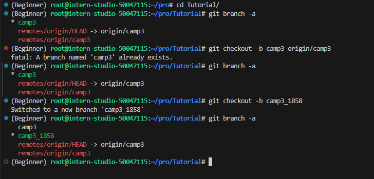
- 创建自我介绍文件，文件路径为 `./data/Git/task/camp3_1858.md`
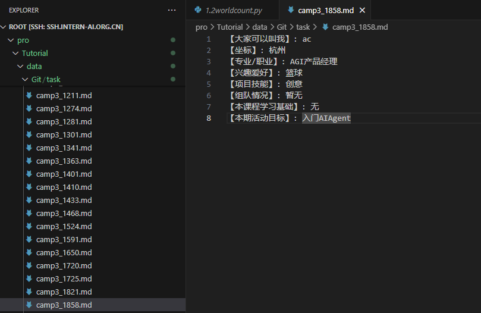
- 提交更改到分支    `git add .` `git commit -m "add camp3_1858.md"` `git push origin camp3_1858`
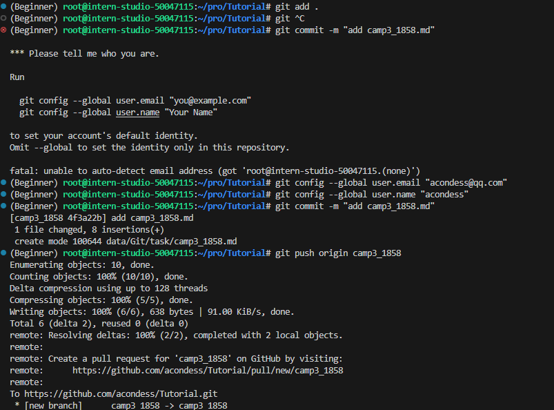
- 请求合并到主分支 
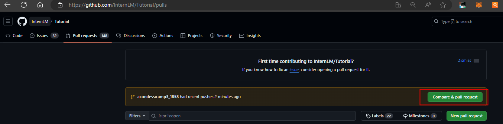
- 按要求填写title
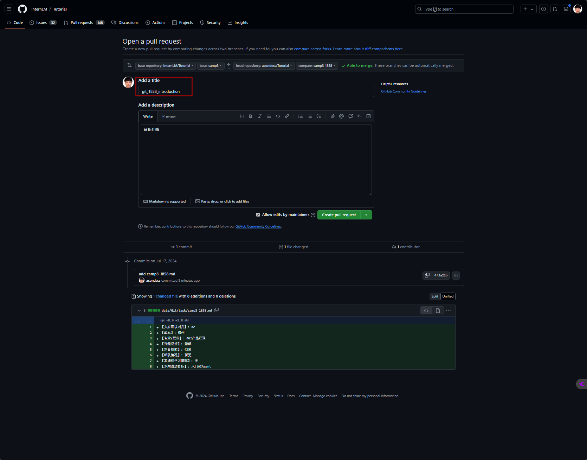
- 提交成功

- 合并请求PR链接：https://github.com/InternLM/Tutorial/pull/1044

### 实践项目

- [项目登记入口](https://aicarrier.feishu.cn/share/base/form/shrcnZAhJeT6PYxhkvRxCnPljkf)

- [项目创建入口](https://github.com/InternLM/Tutorial/discussions/categories/project)
    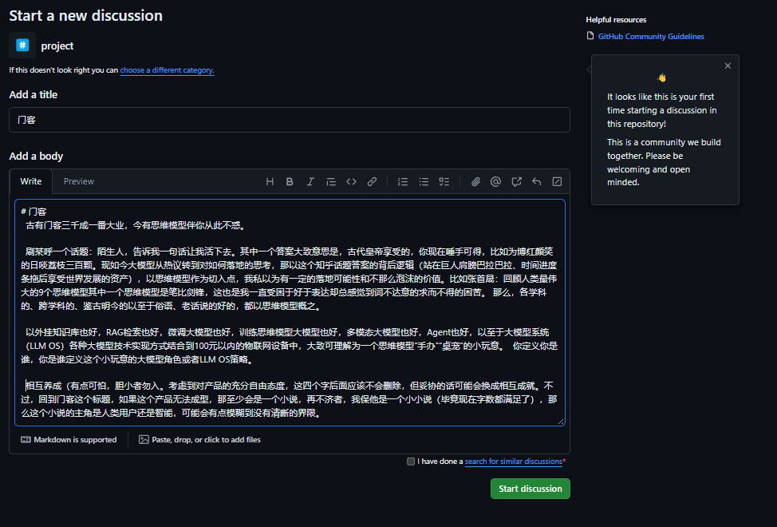

- 创建团队
    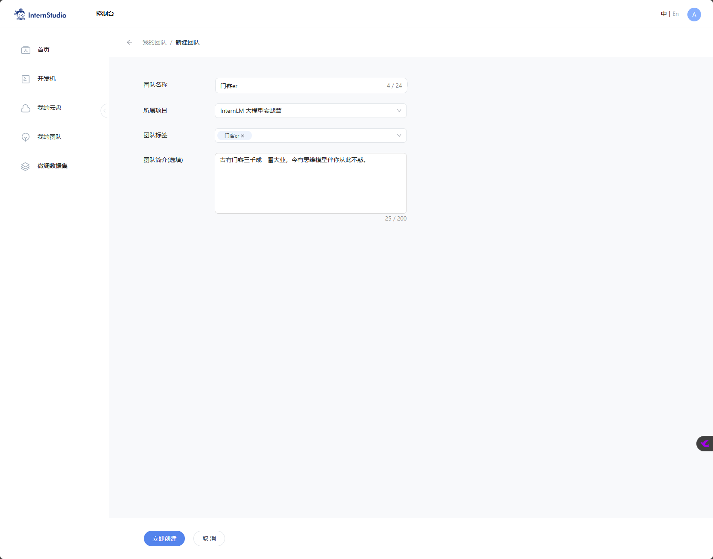

- 创建[github仓库](https://github.com/acondess/menke)
 
    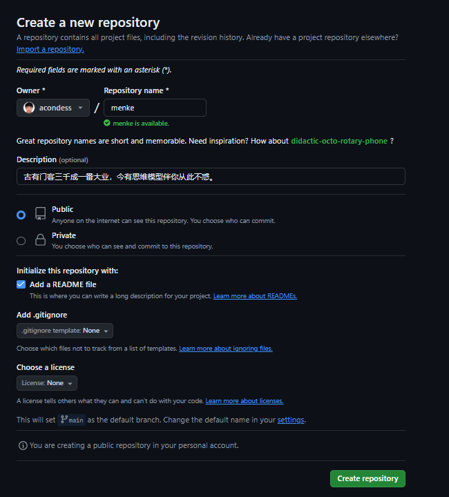