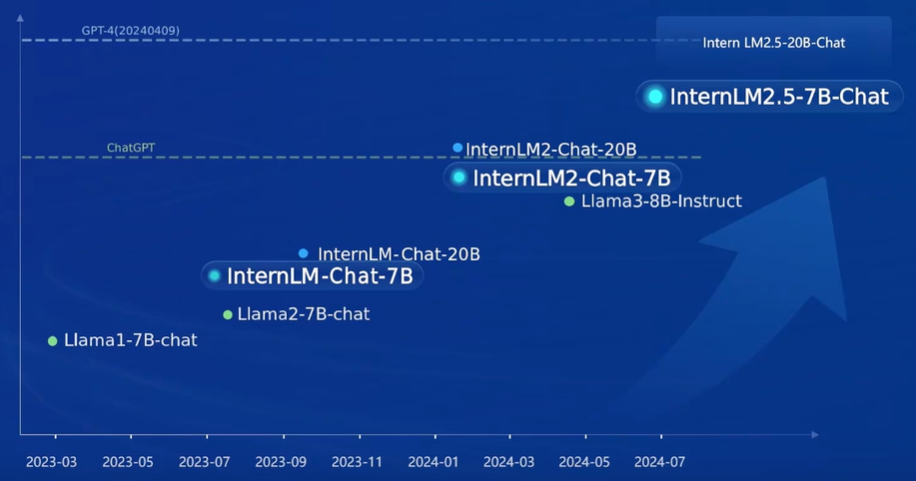

# 2.1 书生大模型全链路开源体系

## 一、任务说明

- [b站视频](https://www.bilibili.com/video/BV18142187g5/)
- [书生·浦语](https://internlm.intern-ai.org.cn/)

##  介绍

### 1. 开源

- InternLM-7B
- InternLM-20B
- InternLM2
- InternLM2.5

### 2. InternLM2.5

- 卓越的推理性能：在数学推理方面取得了同量级模型最优精度，超越了 Llama3 和 Gemma2-9B。
- 有效支持百万字超长上下文：模型在 1 百万字长输入中几乎完美地实现长文“大海捞针”，而且在 LongBench 等长文任务中的表现也达到开源模型中的领先水平。 可以通过 LMDeploy 尝试百万字超长上下文推理。
- 工具调用能力整体升级：InternLM2.5 支持从上百个网页搜集有效信息进行分析推理。
- InternLM2.5 具有更强和更具有泛化性的指令理解、工具筛选与结果反思等能力，新版模型可以更可靠地支持复杂智能体的搭建，支持对工具进行有效的多轮调用，完成较复杂的任务。

### 3. 核心技术思路

-  模型能力飞轮

- 高质量合成数据

### 4. 推理能力

- 100万Token 上下文

### 5. 基于规划和搜索解决复杂问题

### 6. 开原模型谱系

### 7. 全链开源&社区生态

- 数据

- 数据处理

- 预训练（微调框架 XTuner）

- 测评体系 OpenCompass

- 部署 LMDeploy

- 智能体 

- 智能体  Lagent
    

- 智能体 MindSerch

### 8. 企业级知识构建工具

