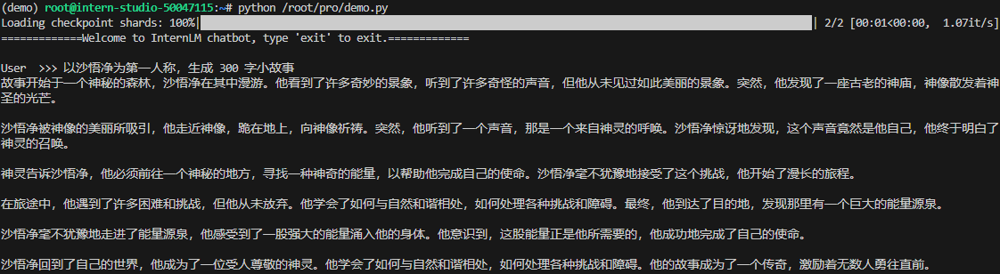

# 2.2 8G 显存玩转书生大模型 Demo

## 一、任务说明


> [参考文档](https://github.com/InternLM/Tutorial/blob/camp3/docs/L1/Demo/readme.md)

### 1.基础任务

- 使用 Cli Demo 完成 InternLM2-Chat-1.8B 模型的部署，并生成 300 字小故事，记录复现过程并截图。

### 2.进阶任务

- 使用 LMDeploy 完成 InternLM-XComposer2-VL-1.8B 的部署，并完成一次图文理解对话，记录复现过程并截图。

- 使用 LMDeploy 完成 InternVL2-2B 的部署，并完成一次图文理解对话，记录复现过程并截图。

## 二、任务提交

### 基础任务

- 使用 Cli Demo 完成 InternLM2-Chat-1.8B 模型的部署

  

### 进阶任务

- 使用 LMDeploy 完成 InternLM-XComposer2-VL-1.8B 的部署

- 使用 LMDeploy 完成 InternVL2-2B 的部署

## 三、复现步骤

### InternLM2-Chat-1.8B 模型的部署

- Step 1 创建虚拟环境并进入

    ``` conda create -n demo python=3.10 -y ```

    ```conda activate demo```

- Step2 安装torch 及相关依赖

    ``` bash
        # 安装 torch
        conda install pytorch==2.1.2 torchvision==0.16.2 torchaudio==2.1.2 pytorch-cuda=12.1 -c pytorch -c nvidia -y

        # 安装transformers库的指定版本4.38
        # transformers是一个强大的自然语言处理(NLP)库，提供了一系列预训练模型，如BERT, GPT等。
        pip install transformers==4.38

        # 安装sentencepiece库的指定版本0.1.99
        # sentencepiece是一个用于文本分词的工具，特别适用于低资源语言或混合语言的文本处理。
        pip install sentencepiece==0.1.99

        # 安装einops库的指定版本0.8.0
        # einops提供了一种简便的方式来操作张量，尤其适合深度学习项目中的数据处理。
        pip install einops==0.8.0

        # 安装protobuf库的指定版本5.27.2
        # protobuf是Google开发的一种数据交换格式，高效且跨语言，常用于定义API数据结构。
        pip install protobuf==5.27.2

        # 安装accelerate库的指定版本0.33.0
        # accelerate库旨在简化深度学习模型的分布式训练过程，提高训练效率。
        pip install accelerate==0.33.0

        # 安装streamlit库的指定版本1.37.0
        # streamlit是一个用于快速构建和分享数据应用的框架，非常适合数据分析和可视化项目。
        pip install streamlit==1.37.0
    ```

- Step3 创建编写demo.py

```python linenums=1
    import torch
    from transformers import AutoTokenizer, AutoModelForCausalLM


    model_name_or_path = "/root/share/new_models/Shanghai_AI_Laboratory/internlm2-chat-1_8b"

    tokenizer = AutoTokenizer.from_pretrained(model_name_or_path, trust_remote_code=True, device_map='cuda:0')
    model = AutoModelForCausalLM.from_pretrained(model_name_or_path, trust_remote_code=True, torch_dtype=torch.bfloat16, device_map='cuda:0')
    model = model.eval()

    system_prompt = """You are an AI assistant whose name is InternLM (书生·浦语).
    - InternLM (书生·浦语) is a conversational language model that is developed by Shanghai AI Laboratory (上海人工智能实验室). It is designed to be helpful, honest, and harmless.
    - InternLM (书生·浦语) can understand and communicate fluently in the language chosen by the user such as English and 中文.
    """

    messages = [(system_prompt, '')]

    print("=============Welcome to InternLM chatbot, type 'exit' to exit.=============")

    while True:
        input_text = input("\nUser  >>> ")
        input_text = input_text.replace(' ', '')
        if input_text == "exit":
            break

        length = 0
        for response, _ in model.stream_chat(tokenizer, input_text, messages):
            if response is not None:
                print(response[length:], flush=True, end="")
                length = len(response)
```

- Step4 运行demo.py

    ``` python /root/pro/demo.py ``` 

- Step5 Streamlit 界面部署InternLM2-Chat-1.8B 模型

    [streamlit_demo.py](../../spaces/streamlit_demo.py)

    ``` streamlit run /root/pro/streamlit_demo.py ```