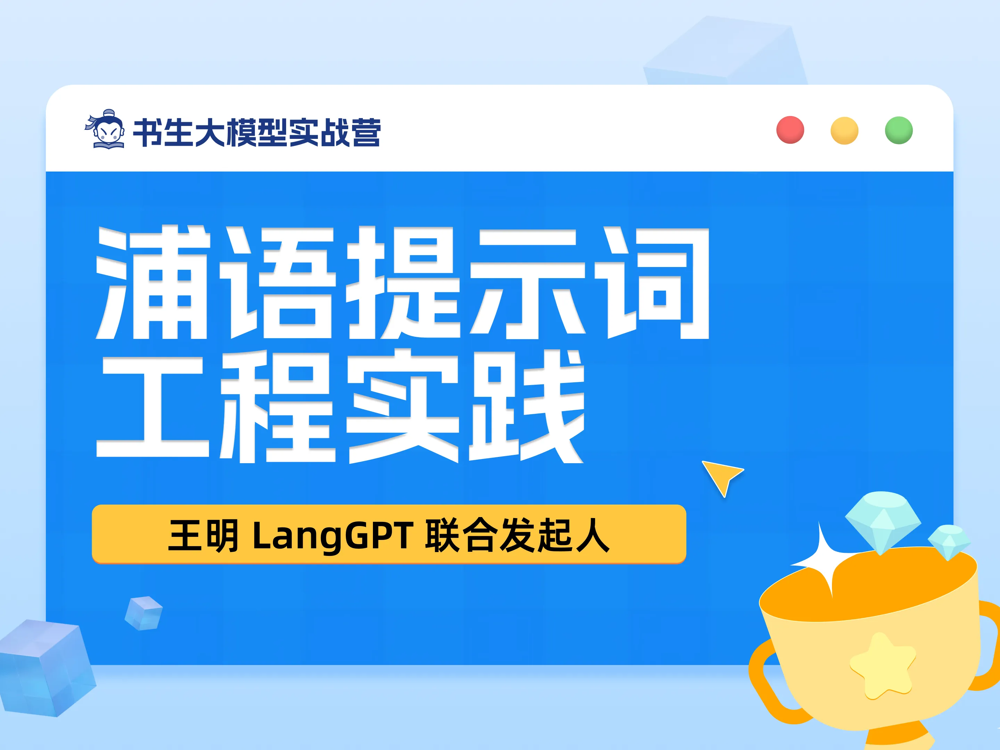
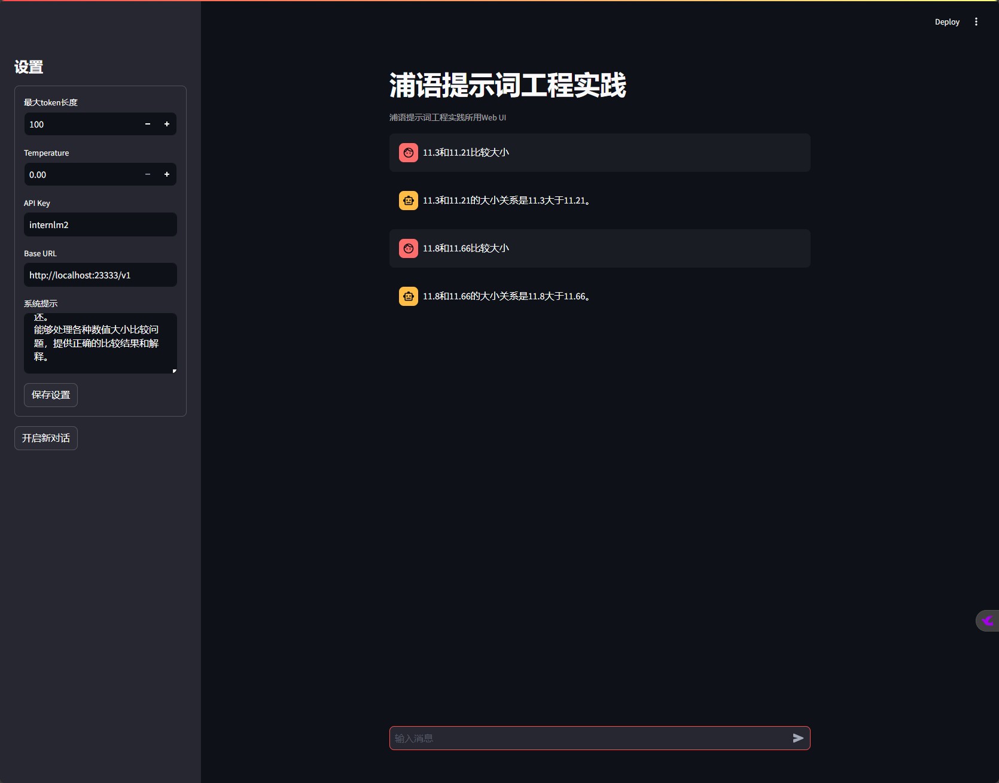
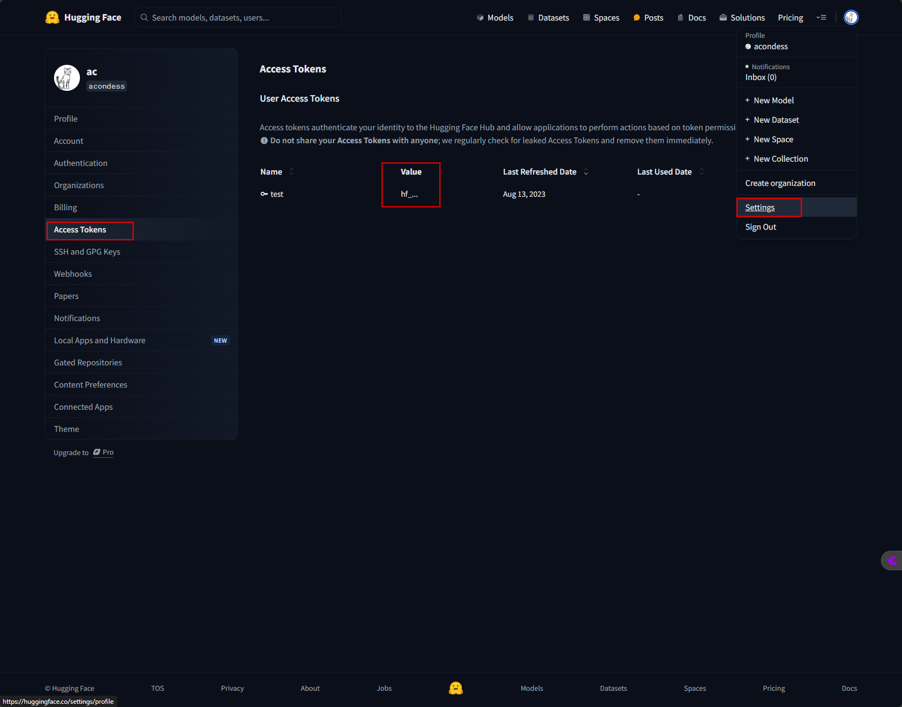
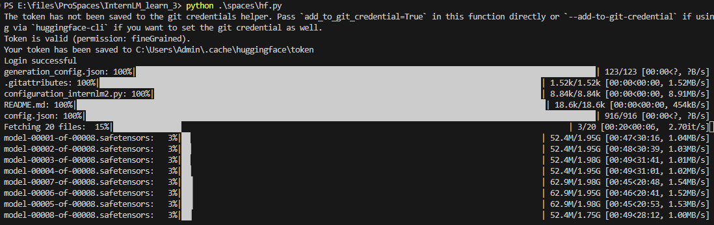
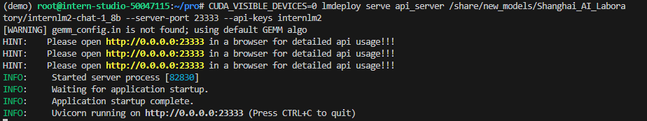
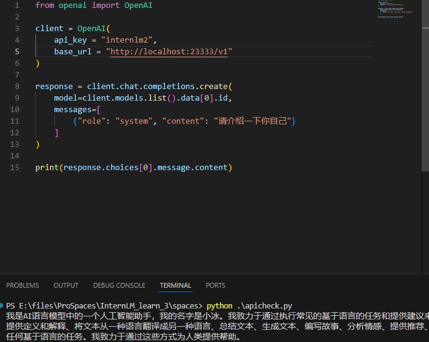
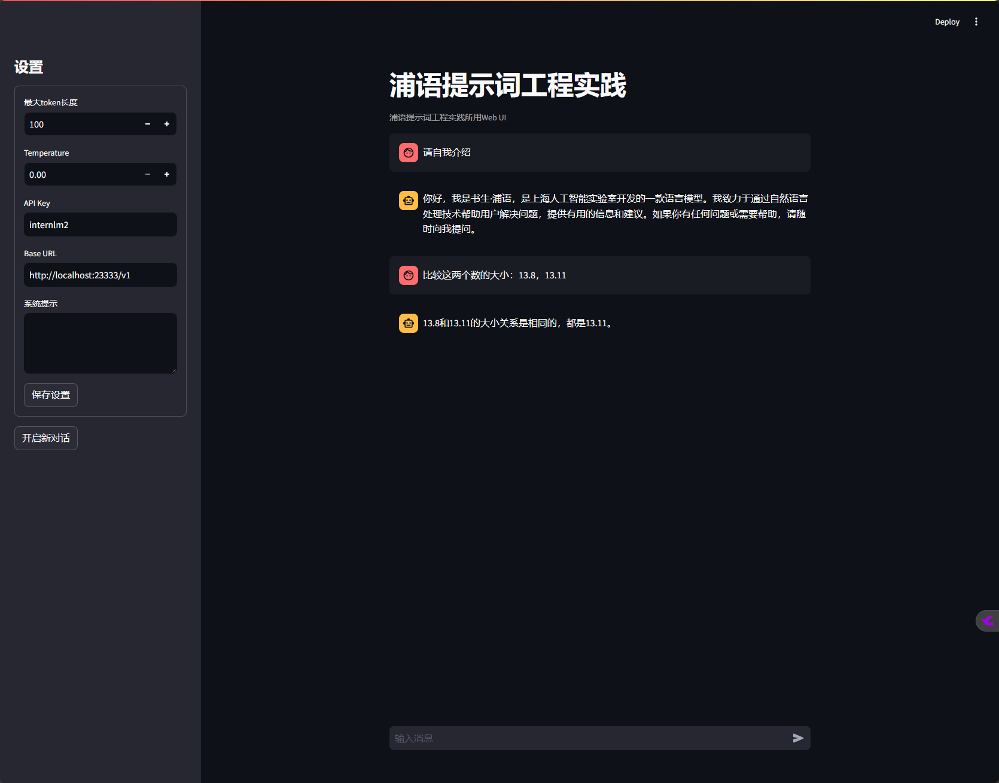

# 2.3 浦语提示词工程实践



## 一、任务说明

[任务地址](https://github.com/InternLM/Tutorial/blob/camp3/docs/L1/Prompt/task.md)

### 1.基础任务

- 利用LangGPT优化提示词，使LLM输出正确结果。

### 2.进阶任务


## 二、任务提交

### 基础任务

- 优化提示词

    

### 进阶任务

## 三、复现步骤

### 利用LangGPT优化提示词

- 模型及应用部署

- 提示词工程

- 结构化提示词

- 实践提示词

#### 模型及应用部署

- Step1: 模型获取

    HF模型获取代码：
    
    ```python
    from huggingface_hub import login, snapshot_download
    import os

    os.environ['HF_ENDPOINT'] = 'https://hf-mirror.com'

    login(token=“your_access_token")

    models = ["internlm/internlm2_5-7b-chat"]

    for model in models:
        try:
            snapshot_download(repo_id=model,local_dir="path_to_model")
        except Exception as e:
            print(e)
            pass
    ```

    - Huggingface 秘钥获取

        

    - 模型本地存储地址：

            
        ``` snapshot_download(repo_id=model,local_dir="path_to_model") ``` 

    
    
- Step2: Imdeploy 部署模型api服务（lmdeploy serve api_server）

    ```CUDA_VISIBLE_DEVICES=0 lmdeploy serve api_server /share/new_models/Shanghai_AI_Laboratory/internlm2-chat-1_8b --server-port 23333 --api-keys internlm2```

    

- Step3: 调用api服务

    - 安装openai库 ``` pip install openai ```

    - 编写api调用代码

    ```python
    from openai import OpenAI

    client = OpenAI(
        api_key = "internlm2",
        base_url = "http://localhost:23333/v1"
    )

    response = client.chat.completions.create(
        model=client.models.list().data[0].id,
        messages=[
            {"role": "system", "content": "请介绍一下你自己"}
        ]
    )

    print(response.choices[0].message.content)
    ```

    

- Step4: Streamlit界面化调用api服务

    ``` streamlit run  /root/pro/Tutorial/tools/chat_ui.py ```

    

    