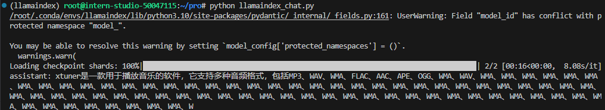
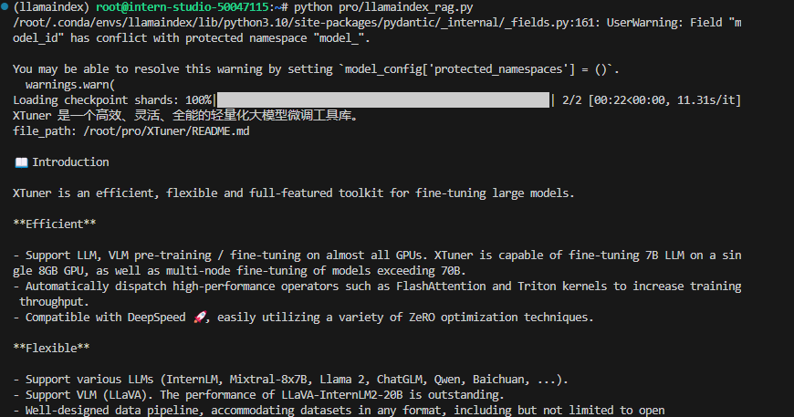
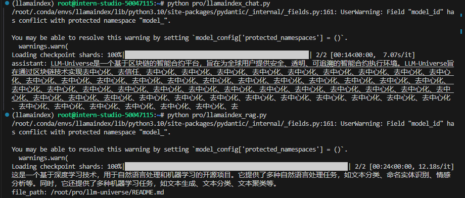
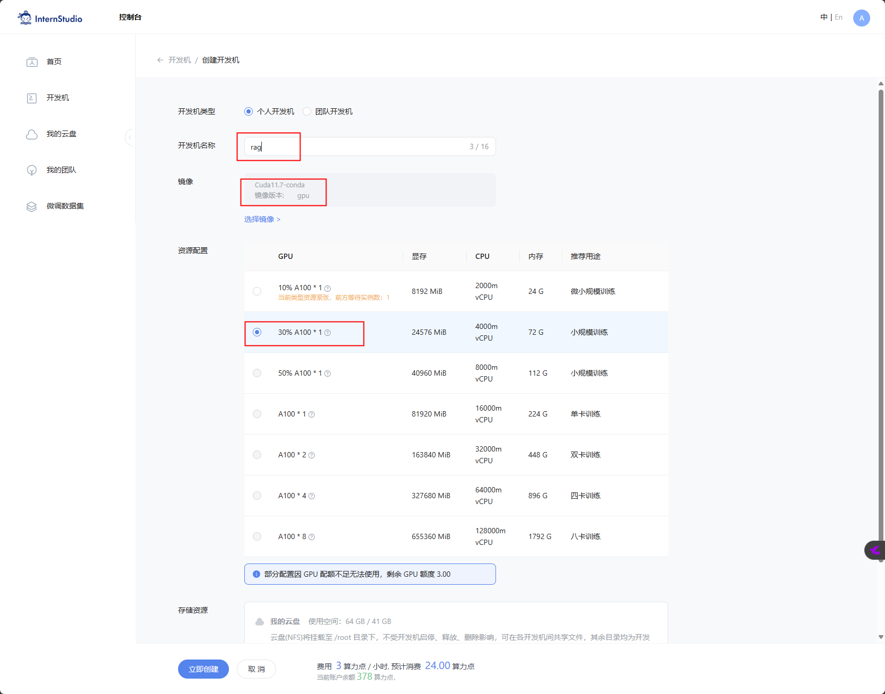
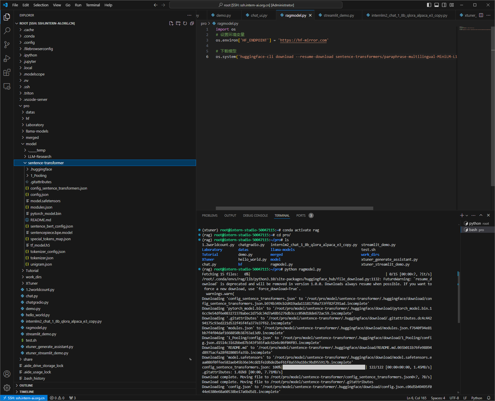
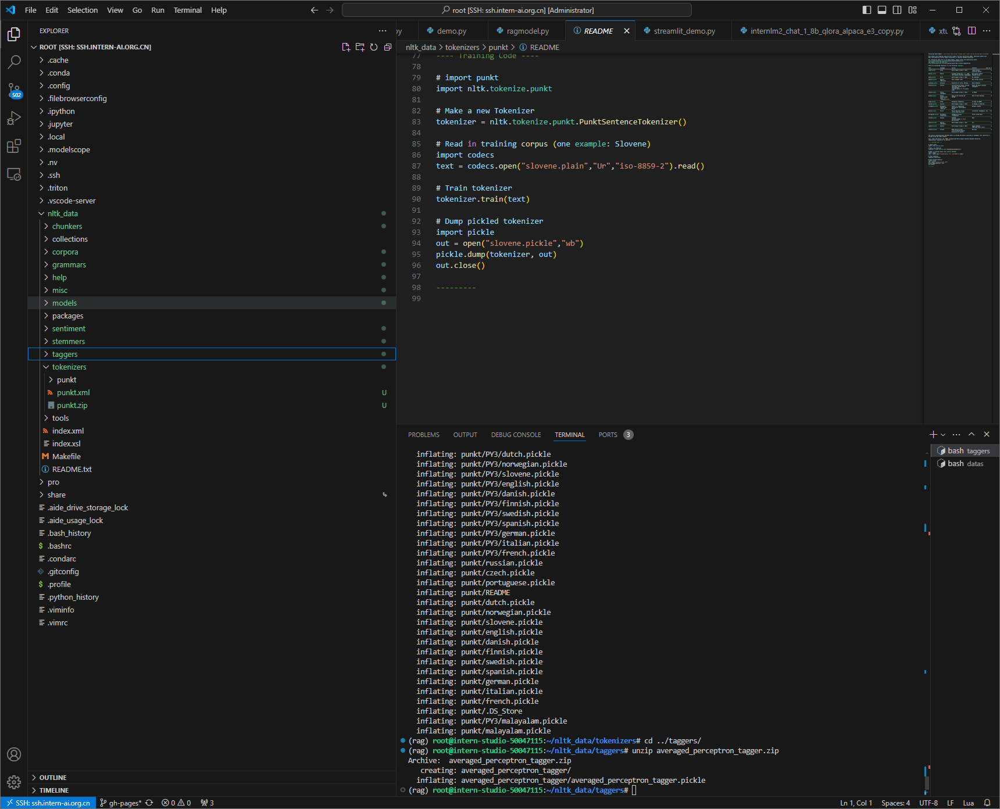
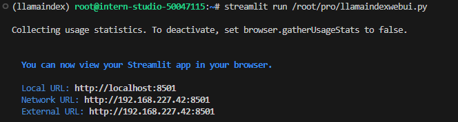

# 2.4 InternLM + LlamaIndex RAG 实践


## 一、任务说明

[任务地址](https://github.com/InternLM/Tutorial/blob/camp3/docs/L1/LlamaIndex/task.md)

### 1.基础任务

- 基于 LlamaIndex 构建自己的 RAG 知识库

## 二、任务提交

### 基础任务

- Xxtuner是什么？

    - before 

        
    
    - after

        

- 自定义问题及知识库

    


## 三、复现步骤

### 概念

  - 检索增强生成（Retrieval Augmented Generation，RAG）

    - RAG 是目前大语言模型相关最知名的工具之一，从外部知识库中检索事实，以便为大型语言模型 (LLM) 提供最准确、最新的信息。

  - 源词向量模型 Sentence Transformer  (a.k.a. SBERT) 是用于访问、使用和训练最先进的文本和图像嵌入模型的首选 Python 模块

    - [文档](https://www.sbert.net/)

### 步骤

- Step1 30% A100 开发机及环境

    

- Step2 conda 创建环境及pytorch安装

    ``` conda create -n rag python=3.10 ```

    ``` conda activate rag ```

    ```conda install pytorch==2.0.1 torchvision==0.15.2 torchaudio==2.0.2 pytorch-cuda=11.7 -c pytorch -c nvidia```

    ```pip install einops```
    
    ```pip install  protobuf ```

    - einops是一个Python库，提供了用于深度学习的高级操作，可以方便地对多维数据进行操作和变换。
    - protobuf是Google开发的一种数据序列化协议，可以将数据结构以二进制格式进行序列化和反序列化，相比于文本格式的数据序列化方式（如JSON），具有更高的效率和更小的体积。

- Step3 Llamaindex、transformers、sentence-transformers安装

    ```pip install llama-index==0.10.38 llama-index-llms-huggingface==0.2.0 "transformers[torch]==4.41.1" "huggingface_hub[inference]==0.23.1" huggingface_hub==0.23.1 sentence-transformers==2.7.0 sentencepiece==0.2.0```

- Step4 词向量模型下载（paraphrase-multilingual-MiniLM-L12-v2）

    [paraphrase-multilingual-MiniLM-L12-v2 地址](https://huggingface.co/sentence-transformers/)

    - 创建ragmodel.py文件
        ```python 
        import os

        # 设置环境变量
        os.environ['HF_ENDPOINT'] = 'https://hf-mirror.com'

        # 下载模型
        os.system('huggingface-cli download --resume-download sentence-transformers/paraphrase-multilingual-MiniLM-L12-v2 --local-dir /root/pro/model/sentence-transformer')
        ```
    - 执行ragmodel.py文件
        ``` python /root/pro/ragmodel.py ```

        

- Step5 NLTK下载

    ``` bash 
        cd /root
        git clone https://gitee.com/yzy0612/nltk_data.git  --branch gh-pages
        cd nltk_data
        mv packages/*  ./
        cd tokenizers
        unzip punkt.zip
        cd ../taggers
        unzip averaged_perceptron_tagger.zip
    ```
    

- Step6 基于llamaindex对话

    - 创建&运行llamaindex_chat.py文件

    ```python
    from llama_index.llms.huggingface import HuggingFaceLLM
    from llama_index.core.llms import ChatMessage
    llm = HuggingFaceLLM(
        model_name="/root/model/internlm2-chat-1_8b",
        tokenizer_name="/root/model/internlm2-chat-1_8b",
        model_kwargs={"trust_remote_code":True},
        tokenizer_kwargs={"trust_remote_code":True}
    )

    rsp = llm.chat(messages=[ChatMessage(content="xtuner是什么？")])
    print(rsp)
    ```

    ``` python /root/pro/llamaindex_chat.py ```

    

- Step7 基于llamaindex知识库对话

    - 安装embedding库

    ``` pip install llama-index-embeddings-huggingface llama-index-embeddings-instructor ```

    - 创建&运行llamaindex_rag.py文件

    ```python
    from llama_index.core import VectorStoreIndex, SimpleDirectoryReader, Settings

    from llama_index.embeddings.huggingface import HuggingFaceEmbedding
    from llama_index.llms.huggingface import HuggingFaceLLM

    #初始化一个HuggingFaceEmbedding对象，用于将文本转换为向量表示
    embed_model = HuggingFaceEmbedding(
    #指定了一个预训练的sentence-transformer模型的路径
        model_name="/root/pro/model/sentence-transformer"
    )
    #将创建的嵌入模型赋值给全局设置的embed_model属性，
    #这样在后续的索引构建过程中就会使用这个模型。
    Settings.embed_model = embed_model

    llm = HuggingFaceLLM(
        model_name="/root/pro/Laboratory/internlm2-chat-1_8b",
        tokenizer_name="/root/pro/Laboratory/internlm2-chat-1_8b",
        model_kwargs={"trust_remote_code":True},
        tokenizer_kwargs={"trust_remote_code":True}
    )
    #设置全局的llm属性，这样在索引查询时会使用这个模型。
    Settings.llm = llm

    #从指定目录读取所有文档，并加载数据到内存中
    documents = SimpleDirectoryReader("/root/pro/XTuner").load_data()
    #创建一个VectorStoreIndex，并使用之前加载的文档来构建索引。
    # 此索引将文档转换为向量，并存储这些向量以便于快速检索。
    index = VectorStoreIndex.from_documents(documents)
    # 创建一个查询引擎，这个引擎可以接收查询并返回相关文档的响应。
    query_engine = index.as_query_engine()
    response = query_engine.query("xtuner是什么?")

    print(response)    
    ```

    

- Step8 替换知识库进行对应问答

    - [知识库github地址](https://github.com/datawhalechina/llm-universe)
        

    - 修改代码
        - llamaindex_chat.py
        ```python
        rsp = llm.chat(messages=[ChatMessage(content="请介绍llm-universe ")])
        ```
        - llamaindex_rag.py
        ```python
        documents = SimpleDirectoryReader("/root/pro/llm-universe").load_data() 
        ```
    - 执行llamaindex_chat.py及llamaindex_rag.py
    

- Step9 webui

    - 安装streamlit
    ``` pip install streamlit ```

    - 创建&运行llamaindexwebui.py文件

    ```python
    import streamlit as st
    from llama_index.core import VectorStoreIndex, SimpleDirectoryReader, Settings
    from llama_index.embeddings.huggingface import HuggingFaceEmbedding
    from llama_index.llms.huggingface import HuggingFaceLLM

    st.set_page_config(page_title="llama_index_demo", page_icon="🦜🔗")
    st.title("llama_index_demo")

    # 初始化模型
    @st.cache_resource
    def init_models():
        embed_model = HuggingFaceEmbedding(
            model_name="/root/pro/model/sentence-transformer"
        )
        Settings.embed_model = embed_model

        llm = HuggingFaceLLM(
            model_name="/root/pro/Laboratory/internlm2-chat-1_8b",
            tokenizer_name="/root/pro/Laboratory/internlm2-chat-1_8b",
            model_kwargs={"trust_remote_code": True},
            tokenizer_kwargs={"trust_remote_code": True}
        )
        Settings.llm = llm

        documents = SimpleDirectoryReader("/root/pro/llm-universe").load_data()
        index = VectorStoreIndex.from_documents(documents)
        query_engine = index.as_query_engine()

        return query_engine

    # 检查是否需要初始化模型
    if 'query_engine' not in st.session_state:
        st.session_state['query_engine'] = init_models()

    def greet2(question):
        response = st.session_state['query_engine'].query(question)
        return response

        
    # Store LLM generated responses
    if "messages" not in st.session_state.keys():
        st.session_state.messages = [{"role": "assistant", "content": "你好，我是你的llm-universe学习助手，有什么我可以帮助你的吗？"}]    

        # Display or clear chat messages
    for message in st.session_state.messages:
        with st.chat_message(message["role"]):
            st.write(message["content"])

    def clear_chat_history():
        st.session_state.messages = [{"role": "assistant", "content": "你好，我是你的llm-universe助手，有什么我可以帮助你的吗？"}]

    st.sidebar.button('Clear Chat History', on_click=clear_chat_history)

    # Function for generating LLaMA2 response
    def generate_llama_index_response(prompt_input):
        return greet2(prompt_input)

    # User-provided prompt
    if prompt := st.chat_input():
        st.session_state.messages.append({"role": "user", "content": prompt})
        with st.chat_message("user"):
            st.write(prompt)

    # Gegenerate_llama_index_response last message is not from assistant
    if st.session_state.messages[-1]["role"] != "assistant":
        with st.chat_message("assistant"):
            with st.spinner("Thinking..."):
                response = generate_llama_index_response(prompt)
                placeholder = st.empty()
                placeholder.markdown(response)
        message = {"role": "assistant", "content": response}
        st.session_state.messages.append(message)
    ```

    - 执行llamaindexwebui.py

    ``` streamlit run /root/pro/llamaindexwebui.py ```

    

## 四、 扩展

### 4.1 embedding模型

- [Sentence Transformer](https://www.sbert.net/)
- [Huggingface of Sentence Transformer](https://huggingface.co/sentence-transformers)
- ollama nomic-embed-text
- [排行榜](https://huggingface.co/spaces/mteb/leaderboard)

### 4.2 LlamaIndex 

- [LlamaIndex github](https://github.com/run-llama/llama_index)