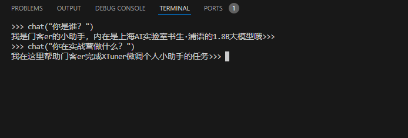
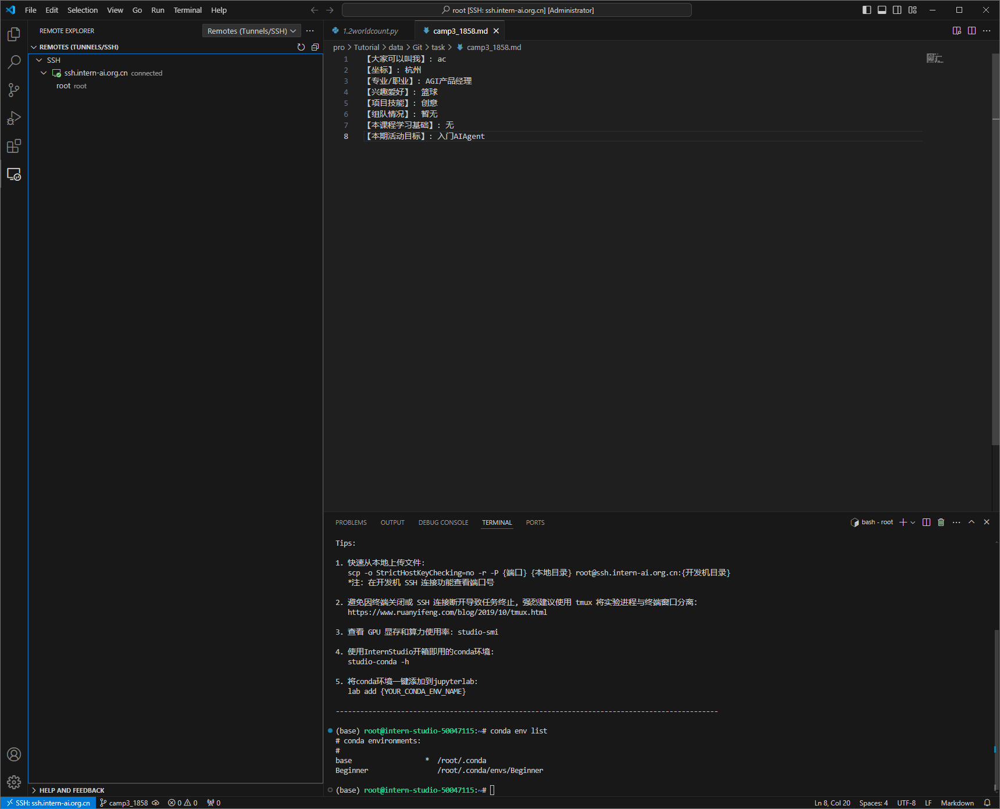
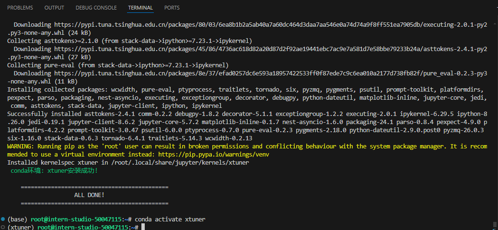
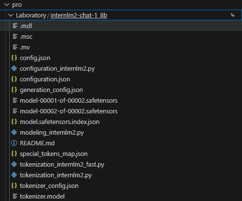
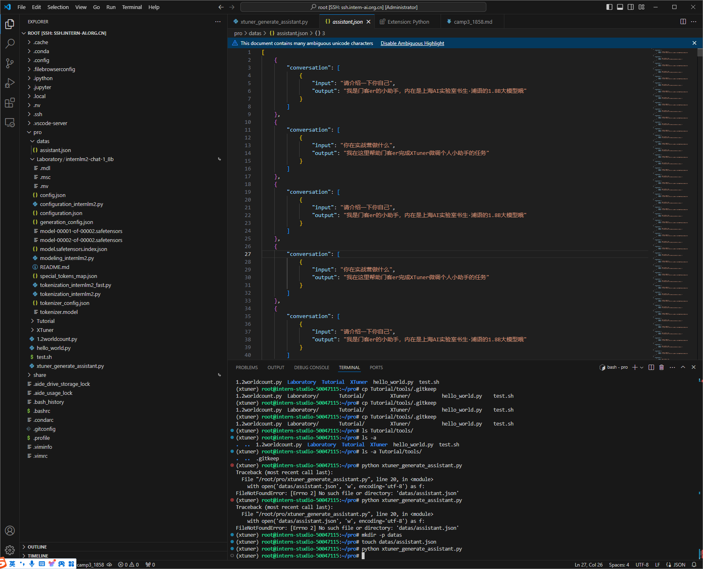
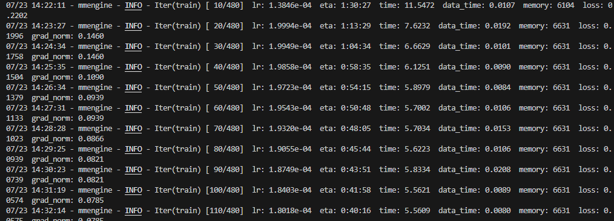
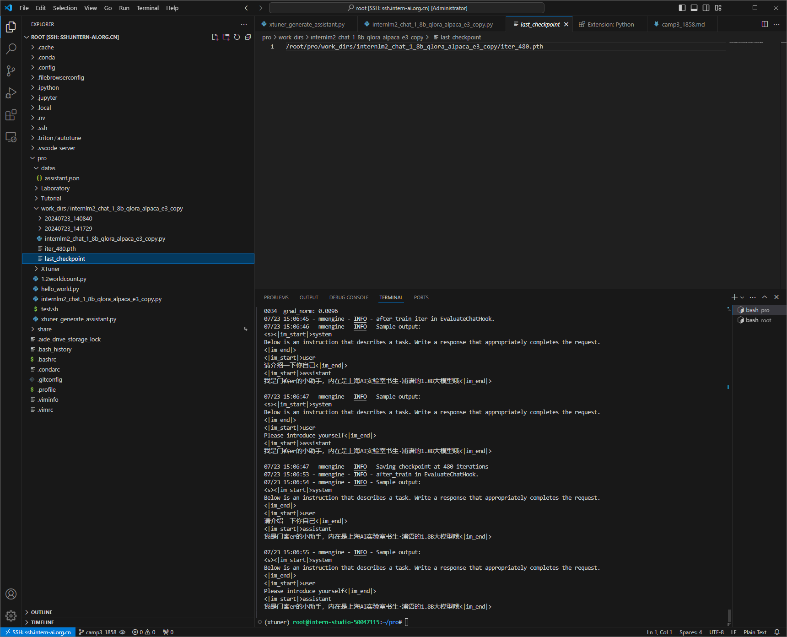
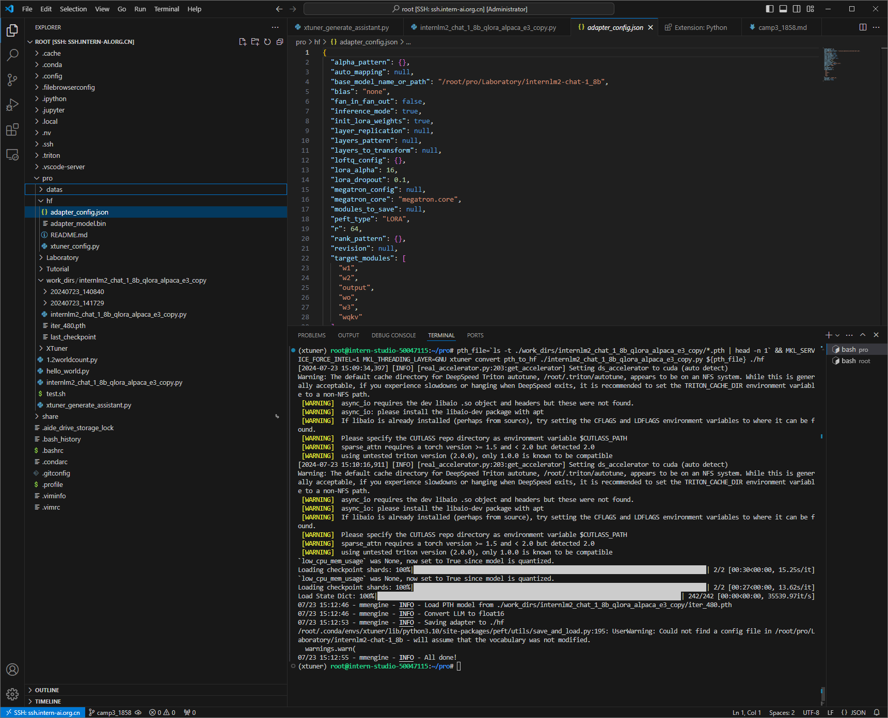
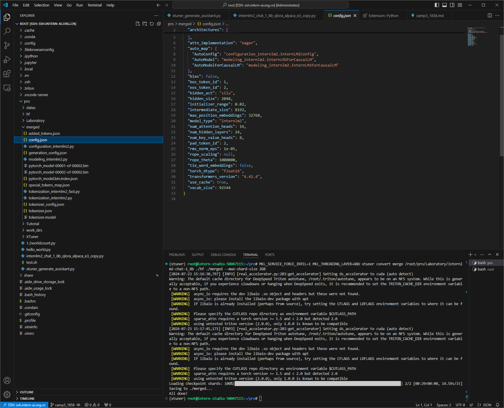

# 2.5 XTuner 微调个人小助手认知

## 一、任务说明
> 参考：[XTuner微调前置基础](https://github.com/InternLM/Tutorial/blob/camp3/docs/L1/XTuner/xtuner_finetune_basic.md)

> 进阶参考： [XTuner微调高级进阶](https://github.com/InternLM/Tutorial/blob/camp3/docs/L1/XTuner/xtuner_finetune_advance.md)

### 1.基础任务
- 使用 XTuner 微调 InternLM2-Chat-1.8B 实现自己的小助手认知

### 2.进阶任务

- 用自己感兴趣的知识对基座模型进行增量预训练微调（选做）
- 在资源允许的情况下，尝试实现多卡微调与分布式微调（选做）
- 将自我认知的模型上传到 OpenXLab，并将应用部署到 OpenXLab（优秀学员必做）

## 二、任务提交

- 使用 XTuner 微调 InternLM2-Chat-1.8B

    

- 将自我认知的模型上传到 OpenXLab，并将应用部署到 OpenXLab

## 三、任务步骤

###  1. XTuner 微调

[XTuner](https://github.com/InternLM/xtuner/blob/main/README_zh-CN.md) 一个大语言模型&多模态模型微调工具箱。


1. 打开开发机使用本地VScode远程连接

    > 参考：[入门岛](../入门岛/1.1%20Linux%20基础知识.md)

    

2. 创建及进入虚拟环境

    ```bash 
    # studio-conda -t <target-conda-name> -o <origin-conda-name> 
    # 将预设的internlm-base环境拷贝到指定的conda环境，命名为xtuner
    studio-conda -t xtuner -o internlm-base
    conda activate xtuner
    ```
    

3. 安装Xturner

    ```bash 
    # 创建一个目录，用来存放源代码
    mkdir -p /root/pro

    cd /root/pro

    git clone -b v0.1.23  https://github.com/InternLM/XTuner

    cd /root/pro/XTuner
    
    # 安装X
    pip install -e '.[deepspeed]'

    # 验证
    xtuner version
    ```

    

4. 基座模型 InternLM2-Chat-1.8B

    ```bash 
    # 链接模型地址
    mkdir -p /root/pro/Laboratory
    ln -s /root/share/new_models/Shanghai_AI_Laboratory/internlm2-chat-1_8b /root/pro/Laboratory/internlm2-chat-1_8b
    ```
    

5. 生成数据集
    ```bash 
    # 创建数据集
    mkdir -p datas
    touch datas/assistant.json
    ```

    ```python linenums=1
    # 校本化写入数据
    import json

    # 设置用户的名字
    name = '门客er'
    # 设置需要重复添加的数据次数
    n =  4650

    # 初始化数据
    data = [
        {"conversation": [{"input": "请介绍一下你自己", "output": "我是{}的小助手，内在是上海AI实验室书生·浦语的1.8B大模型哦".format(name)}]},
        {"conversation": [{"input": "你在实战营做什么", "output": "我在这里帮助{}完成XTuner微调个人小助手的任务".format(name)}]}
    ]

    # 通过循环，将初始化的对话数据重复添加到data列表中
    for i in range(n):
        data.append(data[0])
        data.append(data[1])

    # 将data列表中的数据写入到'datas/assistant.json'文件中
    with open('datas/assistant.json', 'w', encoding='utf-8') as f:
        # 使用json.dump方法将数据以JSON格式写入文件
        # ensure_ascii=False 确保中文字符正常显示
        # indent=4 使得文件内容格式化，便于阅读
        json.dump(data, f, ensure_ascii=False, indent=4)
    ```

    ``` bash linenums=1
    # 运行脚本生成数据
    python xtuner_generate_assistant.py
    ```
    

6. 查找配置文件

    XTuner 提供多个开箱即用的配置文件，可以通过以下命令查看。

    > ```xtuner list-cfg```  命令用于列出内置的所有配置文件。参数 ```-p``` 或 ```--pattern``` 表示模式匹配，后面跟着的内容将会在所有的配置文件里进行模糊匹配搜索，然后返回最有可能得内容。比如我们这里微调的是书生·浦语的模型，我们就可以匹配搜索 internlm2。

    ```bash linenums=1
    xtuner list-cfg -p internlm2
    ```

    <details>
    <summary>相关配置文件</summary>
    ```
    ==========================CONFIGS===========================
    PATTERN: internlm2
    -------------------------------
    internlm2_1_8b_full_alpaca_e3
    internlm2_1_8b_full_custom_pretrain_e1
    internlm2_1_8b_qlora_alpaca_e3
    internlm2_20b_full_custom_pretrain_e1
    internlm2_20b_full_finetune_custom_dataset_e1
    internlm2_20b_qlora_alpaca_e3
    internlm2_20b_qlora_arxiv_gentitle_e3
    internlm2_20b_qlora_code_alpaca_e3
    internlm2_20b_qlora_colorist_e5
    internlm2_20b_qlora_lawyer_e3
    internlm2_20b_qlora_msagent_react_e3_gpu8
    internlm2_20b_qlora_oasst1_512_e3
    internlm2_20b_qlora_oasst1_e3
    internlm2_20b_qlora_sql_e3
    internlm2_5_chat_7b_full_finetune_custom_dataset_e1
    internlm2_5_chat_7b_qlora_alpaca_e3
    internlm2_5_chat_7b_qlora_oasst1_e3
    internlm2_7b_full_custom_pretrain_e1
    internlm2_7b_full_finetune_custom_dataset_e1
    internlm2_7b_full_finetune_custom_dataset_e1_sequence_parallel_4
    internlm2_7b_qlora_alpaca_e3
    internlm2_7b_qlora_arxiv_gentitle_e3
    internlm2_7b_qlora_code_alpaca_e3
    internlm2_7b_qlora_colorist_e5
    internlm2_7b_qlora_json_e3
    internlm2_7b_qlora_lawyer_e3
    internlm2_7b_qlora_msagent_react_e3_gpu8
    internlm2_7b_qlora_oasst1_512_e3
    internlm2_7b_qlora_oasst1_e3
    internlm2_7b_qlora_sql_e3
    internlm2_7b_w_internevo_dataset
    internlm2_7b_w_tokenized_dataset
    internlm2_7b_w_untokenized_dataset
    internlm2_chat_1_8b_dpo_full
    internlm2_chat_1_8b_dpo_full_varlenattn
    internlm2_chat_1_8b_dpo_full_varlenattn_jsonl_dataset
    internlm2_chat_1_8b_full_alpaca_e3
    internlm2_chat_1_8b_orpo_full
    internlm2_chat_1_8b_orpo_full_varlenattn
    internlm2_chat_1_8b_orpo_full_varlenattn_jsonl_dataset
    internlm2_chat_1_8b_qlora_alpaca_e3
    internlm2_chat_1_8b_qlora_custom_sft_e1
    internlm2_chat_1_8b_reward_full_ultrafeedback
    internlm2_chat_1_8b_reward_full_varlenattn_jsonl_dataset
    internlm2_chat_1_8b_reward_full_varlenattn_ultrafeedback
    internlm2_chat_1_8b_reward_qlora_varlenattn_ultrafeedback
    internlm2_chat_20b_full_finetune_custom_dataset_e1
    internlm2_chat_20b_qlora_alpaca_e3
    internlm2_chat_20b_qlora_code_alpaca_e3
    internlm2_chat_20b_qlora_custom_sft_e1
    internlm2_chat_20b_qlora_lawyer_e3
    internlm2_chat_20b_qlora_oasst1_512_e3
    internlm2_chat_20b_qlora_oasst1_e3
    internlm2_chat_7b_dpo_qlora_varlenattn
    internlm2_chat_7b_full_finetune_custom_dataset_e1
    internlm2_chat_7b_orpo_qlora_varlenattn_ultrafeedback_e5
    internlm2_chat_7b_qlora_alpaca_e3
    internlm2_chat_7b_qlora_code_alpaca_e3
    internlm2_chat_7b_qlora_custom_sft_e1
    internlm2_chat_7b_qlora_lawyer_e3
    internlm2_chat_7b_qlora_oasst1_512_e3
    internlm2_chat_7b_qlora_oasst1_e3
    internvl_v1_5_internlm2_26b_finetune
    internvl_v1_5_internlm2_26b_lora_finetune
    internvl_v1_5_internlm2_26b_qlora_finetune
    internvl_v1_5_internlm2_2b_finetune
    internvl_v1_5_internlm2_2b_lora_finetune
    internvl_v1_5_internlm2_2b_qlora_finetune
    internvl_v2_internlm2_26b_finetune
    internvl_v2_internlm2_26b_lora_finetune
    internvl_v2_internlm2_26b_qlora_finetune
    internvl_v2_internlm2_2b_finetune
    internvl_v2_internlm2_2b_lora_finetune
    internvl_v2_internlm2_2b_qlora_finetune
    internvl_v2_internlm2_5_8b_finetune
    internvl_v2_internlm2_5_8b_lora_finetune
    internvl_v2_internlm2_5_8b_qlora_finetune
    llava_internlm2_chat_1_8b_clip_vit_large_p14_336_e1_gpu8_pretrain
    llava_internlm2_chat_1_8b_qlora_clip_vit_large_p14_336_lora_e1_gpu8_finetune
    llava_internlm2_chat_20b_clip_vit_large_p14_336_e1_gpu8_finetune
    llava_internlm2_chat_20b_clip_vit_large_p14_336_e1_gpu8_pretrain
    llava_internlm2_chat_20b_qlora_clip_vit_large_p14_336_lora_e1_gpu8_finetune
    llava_internlm2_chat_7b_clip_vit_large_p14_336_e1_gpu8_finetune
    llava_internlm2_chat_7b_clip_vit_large_p14_336_e1_gpu8_pretrain
    llava_internlm2_chat_7b_qlora_clip_vit_large_p14_336_lora_e1_gpu8_finetune
    =============================================================
    ```
    </details  >

7. 复制&修改配置文件 internlm2_chat_1_8b_qlora_alpaca_e3

    ```
     xtuner copy-cfg internlm2_chat_1_8b_qlora_alpaca_e3 .
    ```

    - 修改模型为本地模型路径
    ```python linenums=1
    pretrained_model_name_or_path = '/root/pro/Laboratory/internlm2-chat-1_8b'
    ```

    - 修改数据集路径
    ```python linenums=1
    alpaca_en_path = '/root/pro/datas/assistant.json'
    ```

    - 修改evaluation_inputs
    ``` bash linenums=1
    evaluation_inputs = [
    '请介绍一下你自己', 'Please introduce yourself'
    ]
    ```

    - 修改数据集加载方式
    ```python linenums=1
    dataset=dict(type=load_dataset, path='json', data_files=dict(train=alpaca_en_path)),
    ```


    - 修改数据对方式

        - 对话内容已经是 input 和 output 的数据对，所以不需要进行格式转换。
    
    ```python linenums=1
    dataset_map_fn=None,
    ```

8. 启动微调

    > ```xtuner train``` 命令用于启动模型微调进程。该命令需要一个参数：```CONFIG```用于指定微调配置文件。这里我们使用修改好的配置文件 ```internlm2_chat_1_8b_qlora_alpaca_e3_copy.py```。

    >    训练过程中产生的所有文件，包括日志、配置文件、检查点文件、微调后的模型等，默认保存在 ```work_dirs``` 目录下，我们也可以通过添加 ```--work-dir``` 指定特定的文件保存位置。

    ``` bash linenums=1
    xtuner train ./internlm2_chat_1_8b_qlora_alpaca_e3_copy.py
    ```

    

    

9. 模型格式转换

    模型转换的本质其实就是将原本使用 Pytorch 训练出来的模型权重文件转换为目前通用的 HuggingFace 格式文件

    > ```xtuner convert pth_to_hf``` 命令用于进行模型格式转换。该命令需要三个参数：```CONFIG``` 表示微调的配置文件， ```PATH_TO_PTH_MODEL``` 表示微调的模型权重文件路径，即要转换的模型权重， ```SAVE_PATH_TO_HF_MODEL``` 表示转换后的 ```HuggingFace``` 格式文件的保存路径。

    ``` bash linenums=1
    pth_file=`ls -t ./work_dirs/internlm2_chat_1_8b_qlora_alpaca_e3_copy/*.pth | head -n 1` && MKL_SERVICE_FORCE_INTEL=1 MKL_THREADING_LAYER=GNU xtuner convert pth_to_hf ./internlm2_chat_1_8b_qlora_alpaca_e3_copy.py ${pth_file} ./hf
    ```
    

10. 模型合并

    hf 文件夹即为我们平时所理解的所谓 “LoRA 模型文件”

    > 可以简单理解：LoRA 模型文件 = Adapter

    对于 LoRA 或者 QLoRA 微调出来的模型其实并不是一个完整的模型，而是一个额外的层（Adapter），训练完的这个层最终还是要与原模型进行合并才能被正常的使用。

    > 对于全量微调的模型（full）其实是不需要进行整合这一步的，因为全量微调修改的是原模型的权重而非微调一个新的 Adapter ，因此是不需要进行模型整合的。

    xtuner convert merge命令用于合并模型。该命令需要三个参数：LLM 表示原模型路径，ADAPTER 表示 Adapter 层的路径， SAVE_PATH 表示合并后的模型最终的保存路径。

    ``` bash linenums=1
    MKL_SERVICE_FORCE_INTEL=1 MKL_THREADING_LAYER=GNU xtuner convert merge /root/pro/Laboratory/internl m2-chat-1_8b ./hf ./merged --max-shard-size 2GB
    ```

    

11. 命令行微调模型对话

    - 进入python环境运行
        ```bash linenums=1
        python
        ```
    
    - 导入库
        ```python
        import torch
        from transformers import AutoTokenizer, AutoModelForCausalLM
        ```

    - 定义加载模型方法

        ```python linenums=1
        def load_model(model_path):
        tokenizer = AutoTokenizer.from_pretrained(model_path, trust_remote_code=True)
        model = AutoModelForCausalLM.from_pretrained(model_path, torch_dtype=torch.float16, trust_remote_code=True).cuda()
        model = model.eval()
        return tokenizer, model
        ```
    
    - 定义对话方法
        ```python linenums=1
        messages = []

        def chat(input_text):
            length = 0
            for response, _ in model.stream_chat(tokenizer, input_text, messages):
                if response is not None:
                    print(response[length:], flush=True, end="")
                    length = len(response)
        ```
    
    - 加载微调模型
        ```python linenums=1
        tokenizer, model = load_model("/root/pro/merged")
        ```
    
    - 运行对话
        ```python linenums=1
        chat("请介绍一下你自己")
        chat("你在实战营做什么？")
        ```
    
    - 对话结果

        

    - 释放缓存

        ```python linenums=1
        del tokenizer, model

        torch.cuda.empty_cache()
        ```


12. UI界面部署

    - 安装streamlit
        ```bash linenums=1
        pip install streamlit==1.36.0
        ```
    
    - 编写streamlit程序

