# 2.6 OpenCompass 评测 InternLM-1.8B 实践


## 一、任务说明

### 1.基础任务

使用 OpenCompass 评测 internlm2-chat-1.8b 模型在 ceval 数据集上的性能，记录复现过程并截图。

### 2.进阶任务

- 使用 OpenCompass 进行主观评测（选做）
- 使用 OpenCompass 评测 InternLM2-Chat-1.8B 模型使用 LMDeploy部署后在 ceval 数据集上的性能（选做）
- 使用 OpenCompass 进行调用API评测（优秀学员必做）

## 二、任务提交

### 基础任务

- 命令行参数法

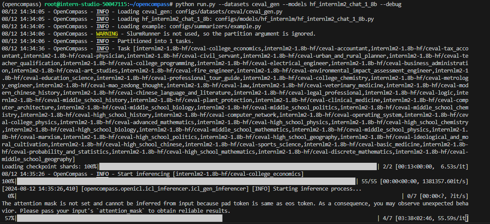

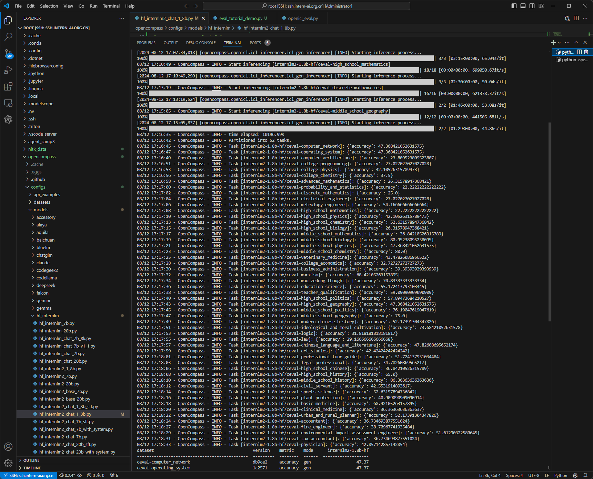

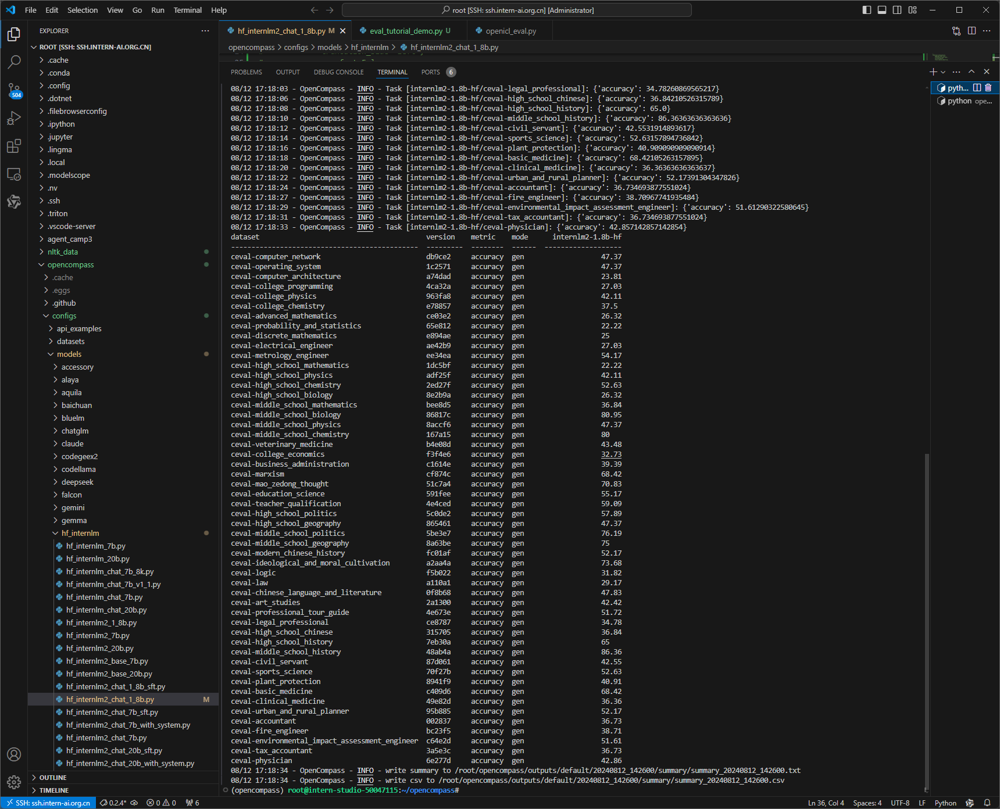

- 配置文件参数法
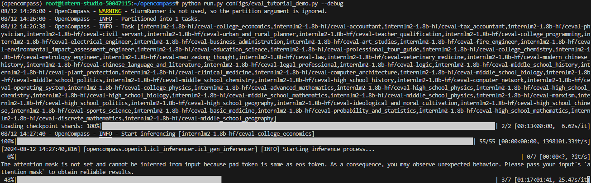

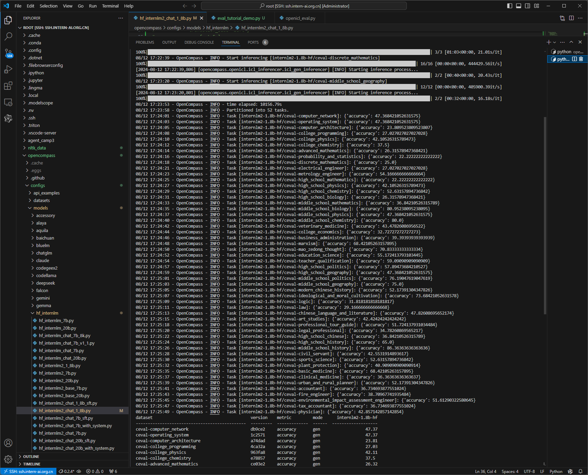

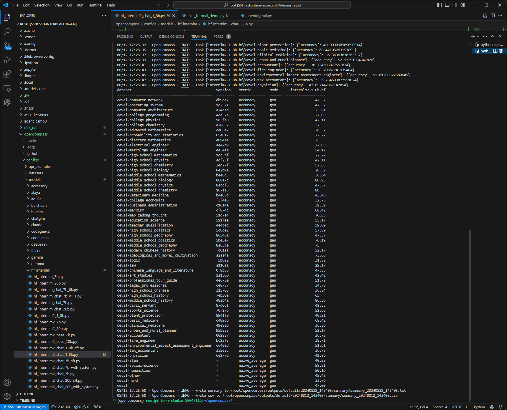

### 进阶任务

## 三、复现步骤

在 OpenCompass 中评估一个模型通常包括以下几个阶段：配置 -> 推理 -> 评估 -> 可视化。

- ***配置***：这是整个工作流的起点。您需要配置整个评估过程，选择要评估的模型和数据集。此外，还可以选择评估策略、计算后端等，并定义显示结果的方式。
- ***推理与评估***：在这个阶段，OpenCompass 将会开始对模型和数据集进行并行推理和评估。推理阶段主要是让模型从数据集产生输出，而评估阶段则是衡量这些输出与标准答案的匹配程度。这两个过程会被拆分为多个同时运行的“任务”以提高效率，但请注意，如果计算资源有限，这种策略可能会使评测变得更慢。如果需要了解该问题及解决方案，可以参考 FAQ: 效率。
- ***可视化***：评估完成后，OpenCompass 将结果整理成易读的表格，并将其保存为 CSV 和 TXT 文件。你也可以激活飞书状态上报功能，此后可以在飞书客户端中及时获得评测状态报告。 接下来，我们将展示 OpenCompass 的基础用法，展示书生浦语在 C-Eval 基准任务上的评估。它们的配置文件可以在 configs/eval_demo.py 中找到。

### 3.1 环境配置

#### 3.1.1 开发机创建

在创建开发机界面选择镜像为 Cuda11.7-conda，并选择 GPU 为10% A100。

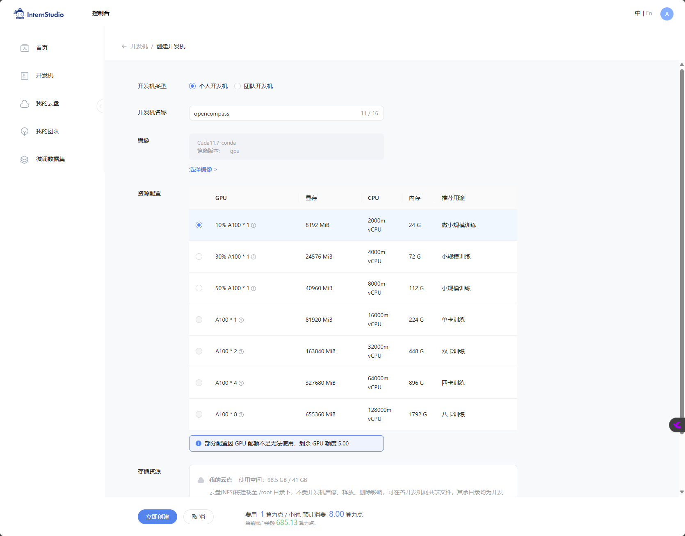

#### 3.1.2 conda环境、源码及依赖安装

```bash
conda create -n opencompass python=3.10
conda activate opencompass
conda install pytorch==2.1.2 torchvision==0.16.2 torchaudio==2.1.2 pytorch-cuda=12.1 -c pytorch -c nvidia -y

# 注意：一定要先 cd /root
cd /root
git clone -b 0.2.4 https://github.com/open-compass/opencompass
cd opencompass
pip install -e .


apt-get update
apt-get install cmake
pip install -r requirements.txt
pip install protobuf
```
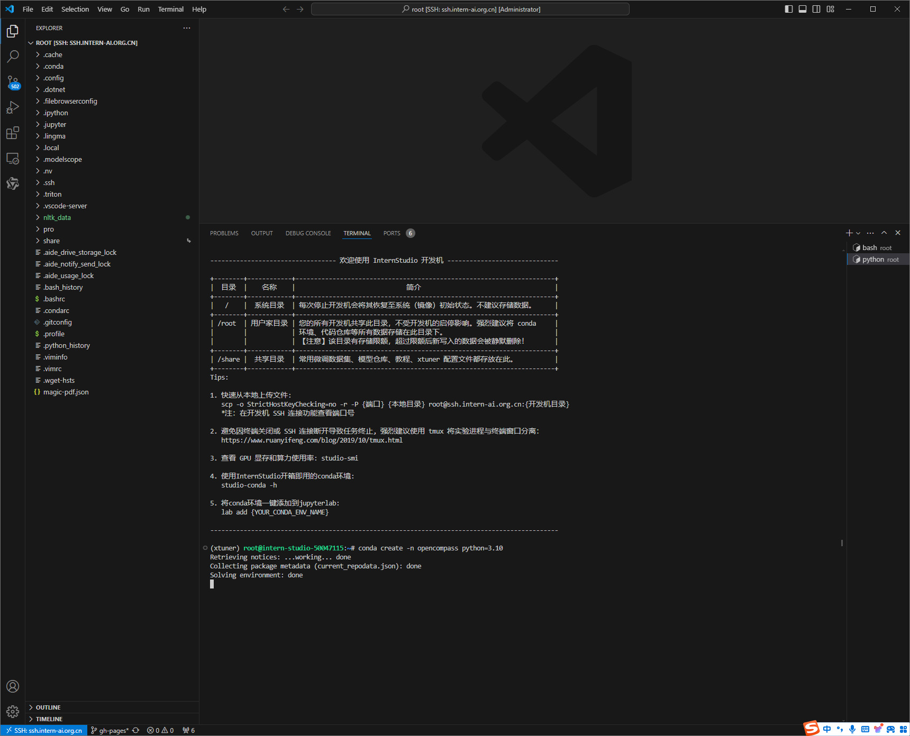

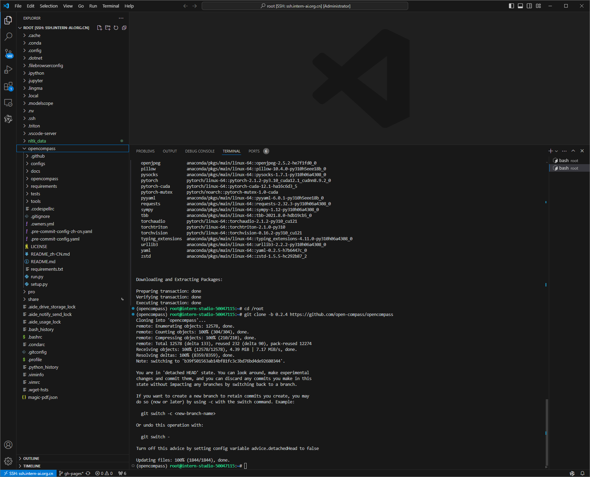

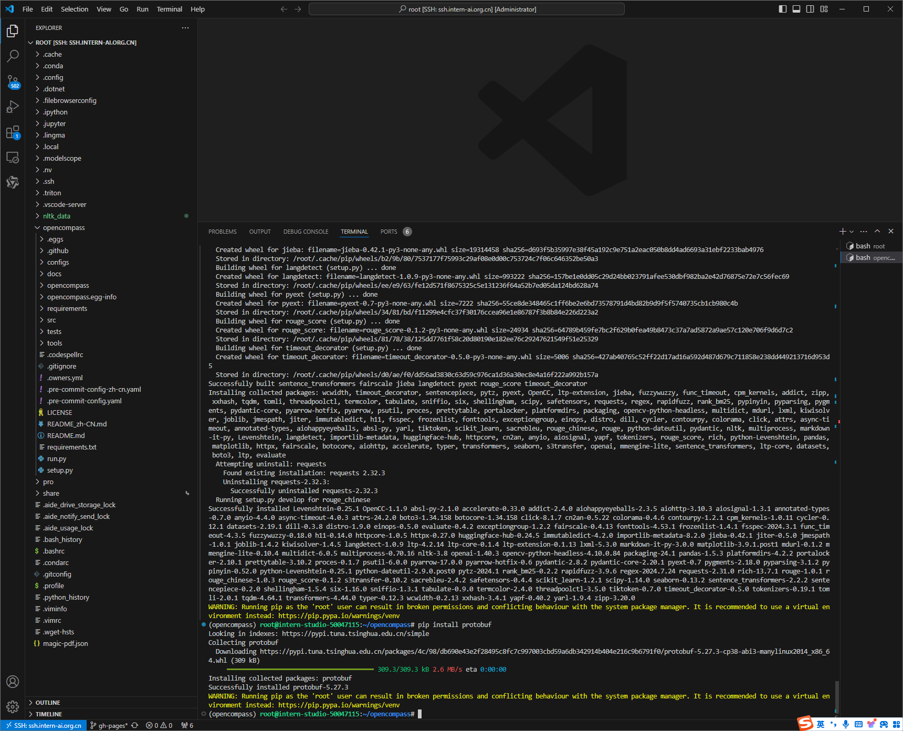

### 3.2 数据

- 拷贝解压开发机提供的数据

```bash
cp /share/temp/datasets/OpenCompassData-core-20231110.zip /root/opencompass/
unzip OpenCompassData-core-20231110.zip
```

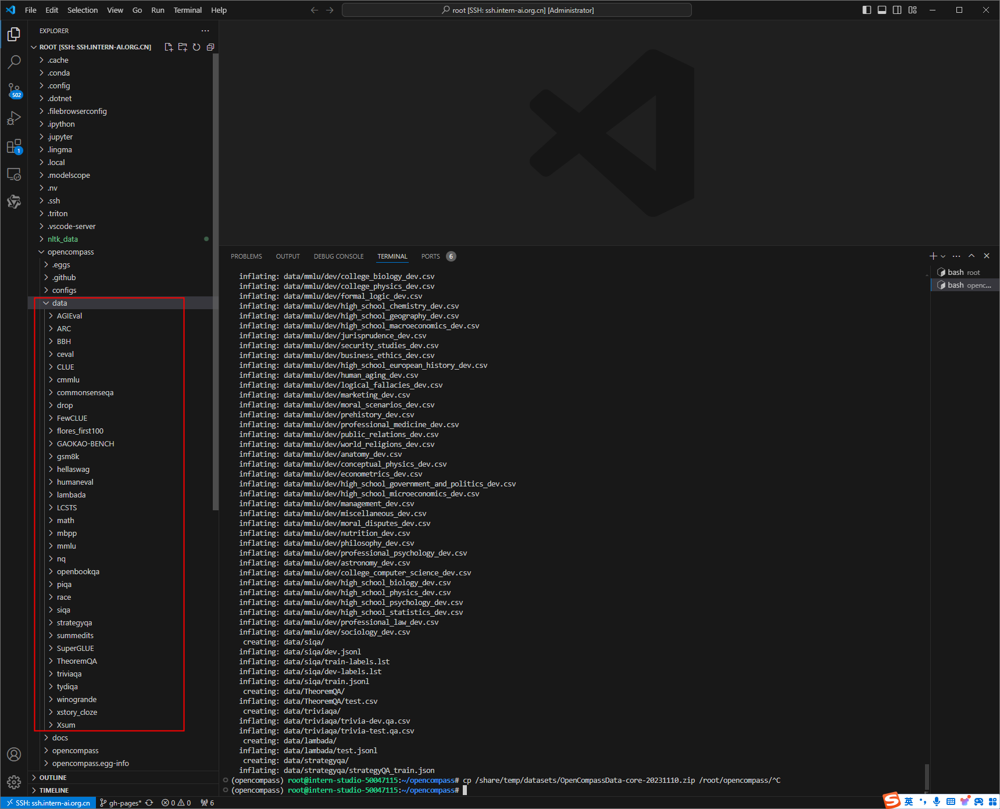

- 查看支持的数据集和模型

```bash
python tools/list_configs.py internlm ceval
```

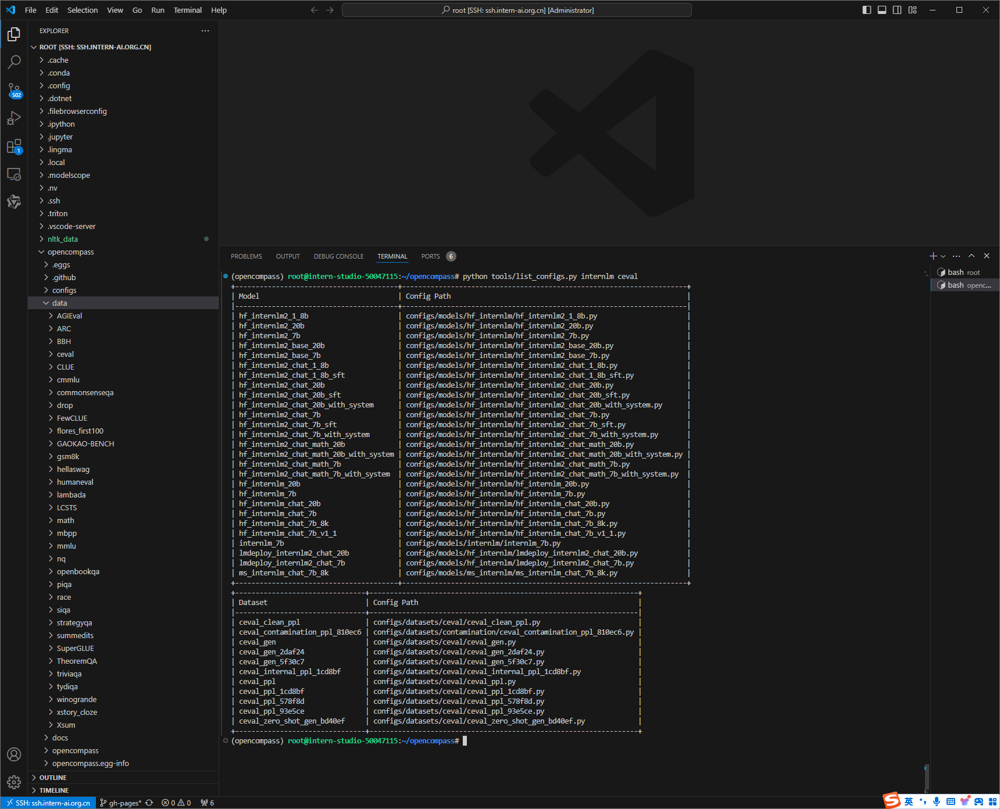


### 3.3 启动测评

#### 3.3.1 使用命令行配置参数法进行评测

- 打开 opencompass文件夹下configs/models/hf_internlm/的hf_internlm2_chat_1_8b.py ,贴入以下代码

```python
from opencompass.models import HuggingFaceCausalLM


models = [
    dict(
        type=HuggingFaceCausalLM,
        abbr='internlm2-1.8b-hf',
        path="/share/new_models/Shanghai_AI_Laboratory/internlm2-chat-1_8b",
        tokenizer_path='/share/new_models/Shanghai_AI_Laboratory/internlm2-chat-1_8b',
        model_kwargs=dict(
            trust_remote_code=True,
            device_map='auto',
        ),
        tokenizer_kwargs=dict(
            padding_side='left',
            truncation_side='left',
            use_fast=False,
            trust_remote_code=True,
        ),
        max_out_len=100,
        min_out_len=1,
        max_seq_len=2048,
        batch_size=8,
        run_cfg=dict(num_gpus=1, num_procs=1),
    )
]
```
- 配置环境参数

```bash
#环境变量配置
export MKL_SERVICE_FORCE_INTEL=1
#或
export MKL_THREADING_LAYER=GNU
```

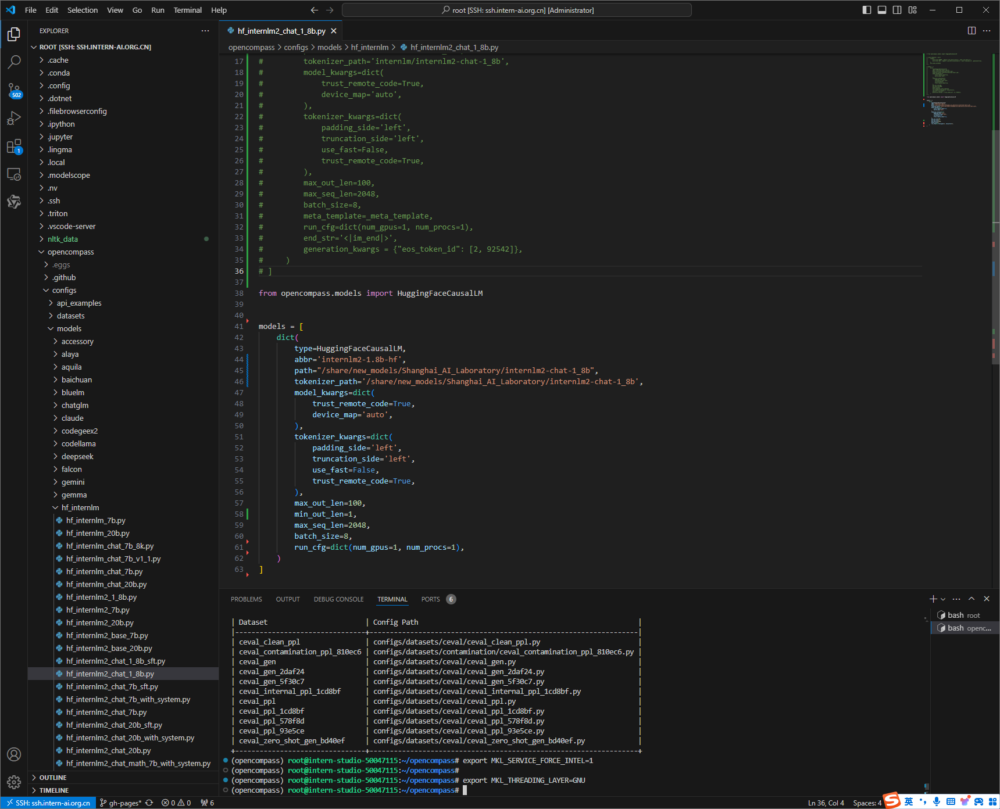

- 运行评测

```bash
python run.py --datasets ceval_gen --models hf_internlm2_chat_1_8b --debug
```

- 命令解析
```bash
python run.py
--datasets ceval_gen \ # 数据集准备
--models hf_internlm2_chat_1_8b \  # 模型准备
--debug
```


#### 3.3.2 使用配置文件改参数法进行评测
除了通过命令行配置实验外，OpenCompass 还允许用户在配置文件中编写实验的完整配置，并通过 run.py 直接运行它。配置文件是以 Python 格式组织的，并且必须包括 datasets 和 models 字段。本次测试配置在 configs文件夹 中。此配置通过 继承机制 引入所需的数据集和模型配置，并以所需格式组合 datasets 和 models 字段。 运行以下代码，在configs文件夹下创建eval_tutorial_demo.py

```bash
cd /root/opencompass/configs
touch eval_tutorial_demo.py
```

```python
from mmengine.config import read_base

with read_base():
    from .datasets.ceval.ceval_gen import ceval_datasets
    from .models.hf_internlm.hf_internlm2_chat_1_8b import models as hf_internlm2_chat_1_8b_models

datasets = ceval_datasets
models = hf_internlm2_chat_1_8b_models
```
```bash
cd /root/opencompass
python run.py configs/eval_tutorial_demo.py --debug
```


### 3.4 测评结果

- 命令行参数法


- 配置文件参数法


