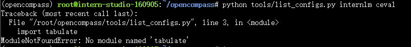

# 2.6 OpenCompass 评测 InternLM-1.8B 实践


## 一、任务说明

### 1.基础任务

使用 OpenCompass 评测 internlm2-chat-1.8b 模型在 ceval 数据集上的性能，记录复现过程并截图。

### 2.进阶任务

- 使用 OpenCompass 进行主观评测（选做）
- 使用 OpenCompass 评测 InternLM2-Chat-1.8B 模型使用 LMDeploy部署后在 ceval 数据集上的性能（选做）
- 使用 OpenCompass 进行调用API评测（优秀学员必做）

## 二、任务提交

### 基础任务


### 进阶任务

## 三、复现步骤

在 OpenCompass 中评估一个模型通常包括以下几个阶段：配置 -> 推理 -> 评估 -> 可视化。

- ***配置***：这是整个工作流的起点。您需要配置整个评估过程，选择要评估的模型和数据集。此外，还可以选择评估策略、计算后端等，并定义显示结果的方式。
- ***推理与评估***：在这个阶段，OpenCompass 将会开始对模型和数据集进行并行推理和评估。推理阶段主要是让模型从数据集产生输出，而评估阶段则是衡量这些输出与标准答案的匹配程度。这两个过程会被拆分为多个同时运行的“任务”以提高效率，但请注意，如果计算资源有限，这种策略可能会使评测变得更慢。如果需要了解该问题及解决方案，可以参考 FAQ: 效率。
- ***可视化***：评估完成后，OpenCompass 将结果整理成易读的表格，并将其保存为 CSV 和 TXT 文件。你也可以激活飞书状态上报功能，此后可以在飞书客户端中及时获得评测状态报告。 接下来，我们将展示 OpenCompass 的基础用法，展示书生浦语在 C-Eval 基准任务上的评估。它们的配置文件可以在 configs/eval_demo.py 中找到。

### 3.1 环境配置

#### 3.1.1 开发机创建

在创建开发机界面选择镜像为 Cuda11.7-conda，并选择 GPU 为10% A100。


#### 3.1.2 conda环境、源码及依赖安装

```bash
conda create -n opencompass python=3.10
conda activate opencompass
conda install pytorch==2.1.2 torchvision==0.16.2 torchaudio==2.1.2 pytorch-cuda=12.1 -c pytorch -c nvidia -y

# 注意：一定要先 cd /root
cd /root
git clone -b 0.2.4 https://github.com/open-compass/opencompass
cd opencompass
pip install -e .


apt-get update
apt-get install cmake
pip install -r requirements.txt
pip install protobuf
```


### 3.2 数据

- 拷贝解压开发机提供的数据

```bash
cp /share/temp/datasets/OpenCompassData-core-20231110.zip /root/opencompass/
unzip OpenCompassData-core-20231110.zip
```


- 查看支持的数据集和模型

```bash
python tools/list_configs.py internlm ceval
```

出现模块未安装问题


执行requirements.txt安装

```bash
pip install -r requirements.txt
```


再次运行可查看到模型和数据对应的配置路径


### 3.3 启动测评

评测 InternLM2-Chat-1.8B 模型在 C-Eval 数据集上的性能。

```bash
python run.py --datasets ceval_gen --hf-path /share/new_models/Shanghai_AI_Laboratory/internlm2-chat-1_8b --tokenizer-path /share/new_models/Shanghai_AI_Laboratory/internlm2-chat-1_8b --tokenizer-kwargs padding_side='left' truncation='left' trust_remote_code=True --model-kwargs trust_remote_code=True device_map='auto' --max-seq-len 1024 --max-out-len 16 --batch-size 2 --num-gpus 1 --debug
```

- 命令解析
```bash
python run.py
--datasets ceval_gen \
--hf-path /share/new_models/Shanghai_AI_Laboratory/internlm2-chat-1_8b \  # HuggingFace 模型路径
--tokenizer-path /share/new_models/Shanghai_AI_Laboratory/internlm2-chat-1_8b \  # HuggingFace tokenizer 路径（如果与模型路径相同，可以省略）
--tokenizer-kwargs padding_side='left' truncation='left' trust_remote_code=True \  # 构建 tokenizer 的参数
--model-kwargs device_map='auto' trust_remote_code=True \  # 构建模型的参数
--max-seq-len 1024 \  # 模型可以接受的最大序列长度
--max-out-len 16 \  # 生成的最大 token 数
--batch-size 2  \  # 批量大小
--num-gpus 1  # 运行模型所需的 GPU 数量
--debug
```

- Debug出的错误

  mkl-service + Intel(R) MKL MKL_THREADING_LAYER=INTEL is incompatible with libgomp.so.1 ... 
  


新增环境变量
```bash
 export MKL_SERVICE_FORCE_INTEL=1
```

 [问题解决参考](https://blog.csdn.net/dou3516/article/details/121396950)

 个人理解为多卡训练中环境设置的问题。（显卡资源虚拟化、容器编排调度）


### 3.4 测评结果

- 输出内容


