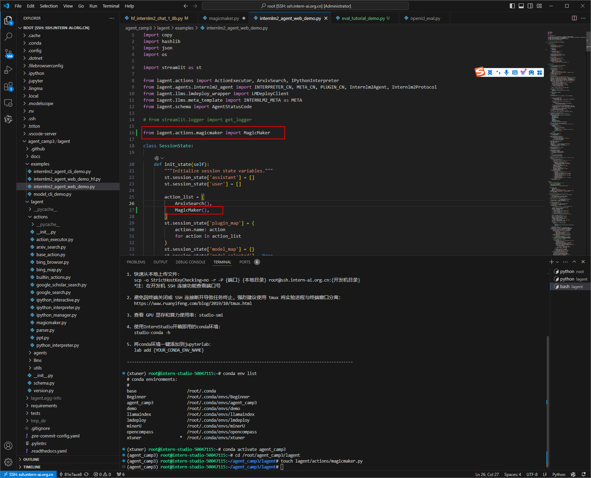

# 3.2 Lagent 自定义你的 Agent 智能体


## 一、任务说明

### 1.基础任务

- 使用 Lagent 自定义一个智能体，并使用 Lagent Web Demo 成功部署与调用，记录复现过程并截图。

### 2.进阶任务


## 二、任务提交

### 基础任务


- [复现步骤](#35--lagent自定义智能体)


### 进阶任务

## 三、复现步骤

### 3.1 环境配置

开发机选择 30% A100，镜像选择为 Cuda12.2-conda。

``` bash
# 创建环境
conda create -n agent_camp3 python=3.10 -y
# 激活环境
conda activate agent_camp3
# 安装 torch
conda install pytorch==2.1.2 torchvision==0.16.2 torchaudio==2.1.2 pytorch-cuda=12.1 -c pytorch -c nvidia -y
# 安装其他依赖包
pip install termcolor==2.4.0
pip install lmdeploy==0.5.2
```

### 3.2 lagent源码安装

``` bash
# 创建目录以存放代码
mkdir -p /root/agent_camp3
cd /root/agent_camp3
git clone https://github.com/InternLM/lagent.git
cd lagent && git checkout 81e7ace && pip install -e . && cd ..
```

### 3.3 lagent web UI

- LMDeploy 部署 InternLM2.5-7B-Chat，启动一个 API Server。

```bash
conda activate agent_camp3
lmdeploy serve api_server /share/new_models/Shanghai_AI_Laboratory/internlm2_5-7b-chat --model-name internlm2_5-7b-chat
```


- 另启一个窗口，运行 Lagent 的 Web Demo。

```bash 
cd /root/agent_camp3/lagent
conda activate agent_camp3
streamlit run examples/internlm2_agent_web_demo.py
```


### 3.4 本地访问验证

- 端口映射

```bash
ssh -CNg -L 8501:127.0.0.1:8501 -L 23333:127.0.0.1:23333 root@ssh.intern-ai.org.cn -p <你的 SSH 端口号>
```

- 访问 Web Demo

在本地浏览器中打开 localhost:8501，并修改模型名称一栏为 internlm2_5-7b-chat，修改模型 ip一栏为127.0.0.1:23333，选择插件为 ArxivSeerch.


输入提示词：``` 搜索Mindsearch相关论文``` 


### 3.5  lagent自定义智能体

- 创建工具文件magicmaker.py

```shell
cd /root/agent_camp3/lagent
touch lagent/actions/magicmaker.py
```
- 编写magicmaker.py

```python
import json
import requests

from lagent.actions.base_action import BaseAction, tool_api
from lagent.actions.parser import BaseParser, JsonParser
from lagent.schema import ActionReturn, ActionStatusCode


class MagicMaker(BaseAction):
    styles_option = [
        'dongman',  # 动漫
        'guofeng',  # 国风
        'xieshi',   # 写实
        'youhua',   # 油画
        'manghe',   # 盲盒
    ]
    aspect_ratio_options = [
        '16:9', '4:3', '3:2', '1:1',
        '2:3', '3:4', '9:16'
    ]

    def __init__(self,
                 style='guofeng',
                 aspect_ratio='4:3'):
        super().__init__()
        if style in self.styles_option:
            self.style = style
        else:
            raise ValueError(f'The style must be one of {self.styles_option}')
        
        if aspect_ratio in self.aspect_ratio_options:
            self.aspect_ratio = aspect_ratio
        else:
            raise ValueError(f'The aspect ratio must be one of {aspect_ratio}')
    
    @tool_api
    def generate_image(self, keywords: str) -> dict:
        """Run magicmaker and get the generated image according to the keywords.

        Args:
            keywords (:class:`str`): the keywords to generate image

        Returns:
            :class:`dict`: the generated image
                * image (str): path to the generated image
        """
        try:
            response = requests.post(
                url='https://magicmaker.openxlab.org.cn/gw/edit-anything/api/v1/bff/sd/generate',
                data=json.dumps({
                    "official": True,
                    "prompt": keywords,
                    "style": self.style,
                    "poseT": False,
                    "aspectRatio": self.aspect_ratio
                }),
                headers={'content-type': 'application/json'}
            )
        except Exception as exc:
            return ActionReturn(
                errmsg=f'MagicMaker exception: {exc}',
                state=ActionStatusCode.HTTP_ERROR)
        image_url = response.json()['data']['imgUrl']
        return {'image': image_url}
```

- 适配我们的自定义工具

    - 修改 /root/agent_camp3/lagent/examples/internlm2_agent_web_demo.py

    

    - 重新运行steamlit 命令 `streamlit run examples/internlm2_agent_web_demo.py`,配置工具名称为magicmaker，修改模型名称为internlm2_5-7b-chat，修改模型 ip一栏为127.0.0.1:23333，输入提示词：``` 帮我生成一副油画的钢铁侠```

    

    - 多插件测试

    


