# 3.3 LMDeploy 量化部署进阶实践


## 一、任务说明

### 1.基础任务

- 使用结合W4A16量化与kv cache量化的internlm2_5-7b-chat模型封装本地API并与大模型进行一次对话，作业截图需包括显存占用情况与大模型回复，参考4.1 API开发(优秀学员必做)

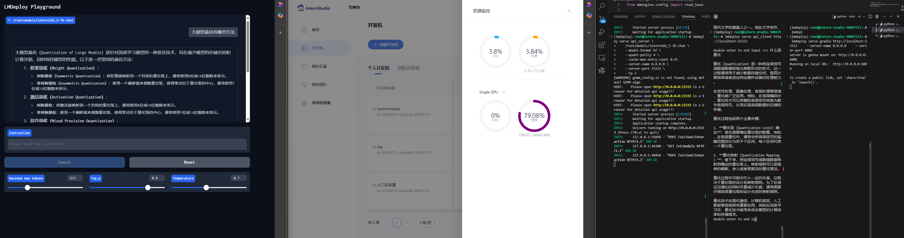

- 使用Function call功能让大模型完成一次简单的"加"与"乘"函数调用，作业截图需包括大模型回复的工具调用情况，参考4.2 Function call(选做)

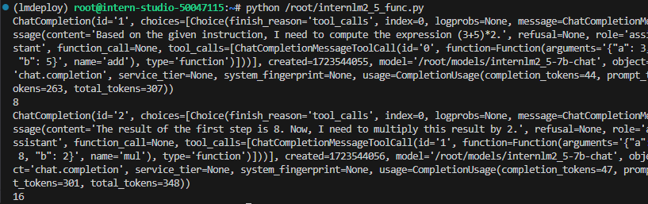

### 2.进阶任务


## 二、任务提交

### 基础任务

- W4A16量化与kv cache量化的internlm2_5-7b-chat显存占用情况与大模型回复

- Function call功能让大模型完成一次简单的"加"与"乘"函数调用,大模型回复的工具调用情况

### 进阶任务

## 三、复现步骤

1. LMDeploy环境
2. LMDeploy与InternLM2.5
3. LMDeploy与InternVL2
4. LMDeploy的api服务与Function call

### 3.1 LMDeploy环境

- 开发及设置

30%A100*1(24GB显存容量)

```shell
conda create -n lmdeploy  python=3.10 -y
conda activate lmdeploy
conda install pytorch==2.1.2 torchvision==0.16.2 torchaudio==2.1.2 pytorch-cuda=12.1 -c pytorch -c nvidia -y
pip install timm==1.0.8 openai==1.40.3 lmdeploy[all]==0.5.3
```

- 获取internlm2_5-7b-chat和InternVL2-26B模型

```shell
mkdir /root/models
ln -s /root/share/new_models//Shanghai_AI_Laboratory/internlm2_5-7b-chat /root/models
ln -s /root/share/new_models/OpenGVLab/InternVL2-26B /root/models
```

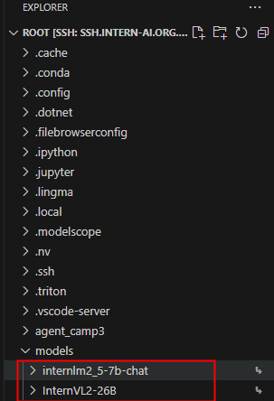

- 测试模型

```shell
conda activate lmdeploy
lmdeploy chat /root/models/internlm2_5-7b-chat
```

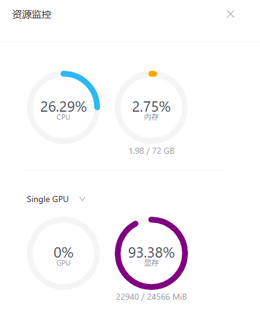

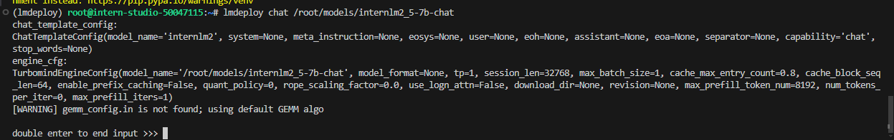

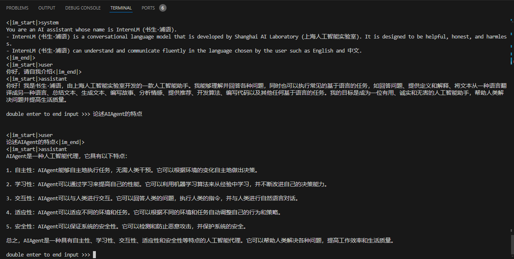

- 服务部署

```shell
conda activate lmdeploy
lmdeploy serve api_server \
    /root/models/internlm2_5-7b-chat \
    --model-format hf \
    --quant-policy 0 \
    --server-name 0.0.0.0 \
    --server-port 23333 \
    --tp 1
```

- 另起一个终端服务访问（CLI(“命令行界面” Command Line Interface的缩写)-client）

```shell
conda activate lmdeploy
lmdeploy serve api_client http://localhost:23333
```

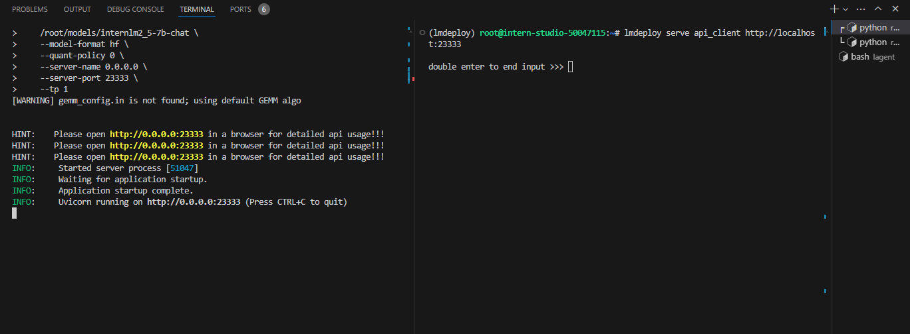

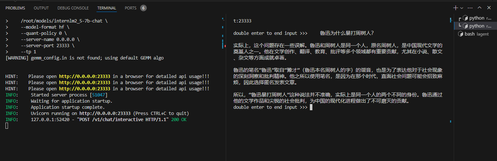

- 基于api服务调用，启动gradio界面(另起终端)

```shell
conda activate lmdeploy
lmdeploy serve gradio http://localhost:23333 \
    --server-name 0.0.0.0 \
    --server-port 6006
```

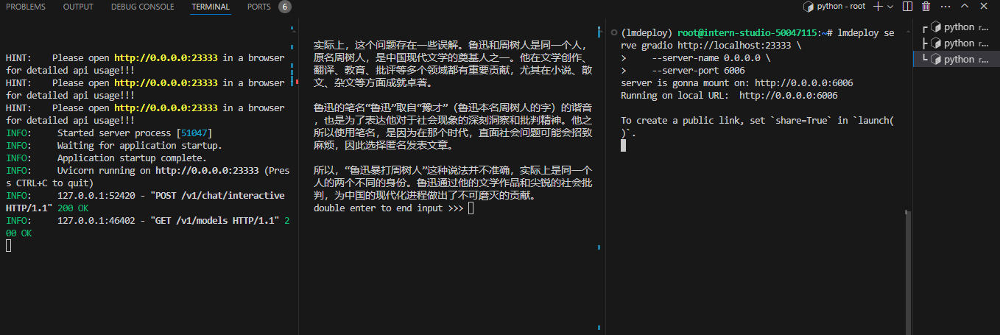

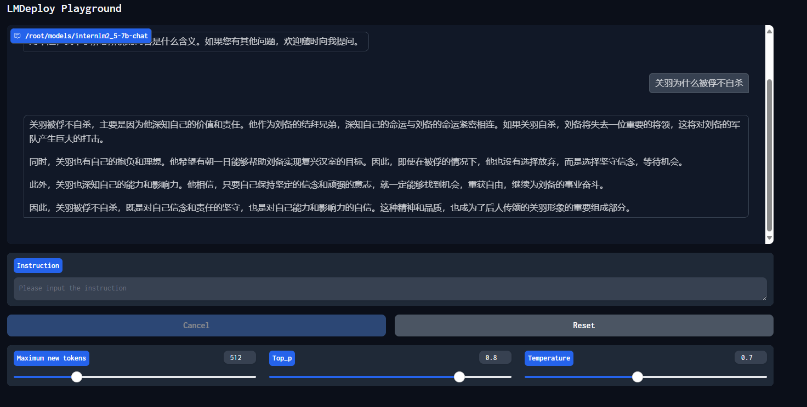

### 3.2 LMDeploy量化

LMDeploy 提供了权重量化和 k/v cache两种策略。

#### 3.2.1 kv cache量化

kv cache是一种缓存技术，通过存储键值对的形式来复用计算结果，以达到提高性能和降低内存消耗的目的。

在大规模训练和推理中，kv cache可以显著减少重复计算量，从而提升模型的推理速度。理想情况下，kv cache全部存储于显存，以加快访存速度。

模型在运行时，占用的显存可大致分为三部分：模型参数本身占用的显存、kv cache占用的显存，以及中间运算结果占用的显存。

自 v0.4.0 起，LMDeploy 支持在线 kv cache int4/int8 量化，量化方式为 per-head per-token 的非对称量化。此外，通过 LMDeploy 应用 kv 量化非常简单，只需要设定 quant_policy 和cache-max-entry-count参数。

目前，LMDeploy 规定 qant_policy=4 表示 kv int4 量化，quant_policy=8 表示 kv int8 量化。

```shell
lmdeploy serve api_server \
    /root/models/internlm2_5-7b-chat \
    --model-format hf \
    --quant-policy 4 \
    --cache-max-entry-count 0.4\
    --server-name 0.0.0.0 \
    --server-port 23333 \
    --tp 1
```

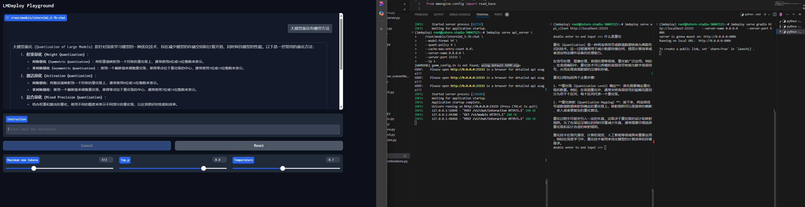

#### 3.2.2 权重量化

W4：这通常表示权重量化为4位整数（int4）。这意味着模型中的权重参数将从它们原始的浮点表示（例如FP32、BF16或FP16，Internlm2.5精度为BF16）转换为4位的整数表示。这样做可以显著减少模型的大小。

A16：这表示激活（或输入/输出）仍然保持在16位浮点数（例如FP16或BF16）。激活是在神经网络中传播的数据，通常在每层运算之后产生。

因此，W4A16的量化配置意味着：
- 权重被量化为4位整数。
- 激活保持为16位浮点数。

```shell
lmdeploy lite auto_awq \
   /root/models/internlm2_5-7b-chat \
  --calib-dataset 'ptb' \
  --calib-samples 128 \
  --calib-seqlen 2048 \
  --w-bits 4 \
  --w-group-size 128 \
  --batch-size 1 \
  --search-scale False \
  --work-dir /root/models/internlm2_5-7b-chat-w4a16-4bit
  ```

- lmdeploy lite auto_awq: lite这是LMDeploy的命令，用于启动量化过程，而auto_awq代表自动权重量化（auto-weight-quantization）。
- /root/models/internlm2_5-7b-chat: 模型文件的路径。
- --calib-dataset 'ptb': 这个参数指定了一个校准数据集，这里使用的是’ptb’（Penn Treebank，一个常用的语言模型数据集）。
- --calib-samples 128: 这指定了用于校准的样本数量—128个样本
- --calib-seqlen 2048: 这指定了校准过程中使用的序列长度—2048
- --w-bits 4: 这表示权重（weights）的位数将被量化为4位。
- --work-dir /root/models/internlm2_5-7b-chat-w4a16-4bit: 这是工作目录的路径，用于存储量化后的模型和中间结果。

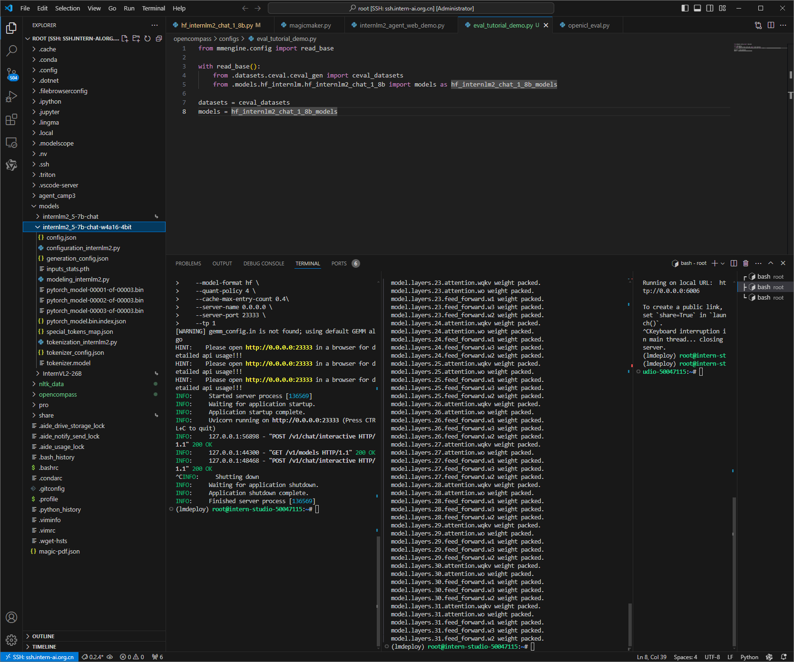

- 模型大小查看

```shell
du -sh /root/models/*
```
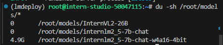

其余文件夹都是以软链接的形式存在的，不占用空间，故显示为0

```shell
du -sh /root/share/new_models/Shanghai_AI_Laboratory/*
```
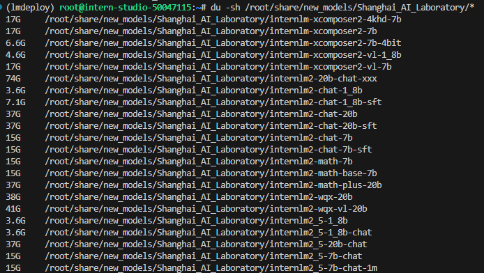

### 3.3 函数调用（大模型应用）

关于Function call，即函数调用功能，它允许开发者在调用模型时，详细说明函数的作用，并使模型能够智能地根据用户的提问来输入参数并执行函数。完成调用后，模型会将函数的输出结果作为回答用户问题的依据。

- 部署大模型服务

```shell
conda activate lmdeploy
lmdeploy serve api_server \
    /root/models/internlm2_5-7b-chat \
    --model-format hf \
    --quant-policy 0 \
    --server-name 0.0.0.0 \
    --server-port 23333 \
    --tp 1
```

- 创建函数文件internlm2_5_func.py

```shell
touch /root/internlm2_5_func.py
```

```python
from openai import OpenAI


def add(a: int, b: int):
    return a + b


def mul(a: int, b: int):
    return a * b


tools = [{
    'type': 'function',
    'function': {
        'name': 'add',
        'description': 'Compute the sum of two numbers',
        'parameters': {
            'type': 'object',
            'properties': {
                'a': {
                    'type': 'int',
                    'description': 'A number',
                },
                'b': {
                    'type': 'int',
                    'description': 'A number',
                },
            },
            'required': ['a', 'b'],
        },
    }
}, {
    'type': 'function',
    'function': {
        'name': 'mul',
        'description': 'Calculate the product of two numbers',
        'parameters': {
            'type': 'object',
            'properties': {
                'a': {
                    'type': 'int',
                    'description': 'A number',
                },
                'b': {
                    'type': 'int',
                    'description': 'A number',
                },
            },
            'required': ['a', 'b'],
        },
    }
}]
messages = [{'role': 'user', 'content': 'Compute (3+5)*2'}]

client = OpenAI(api_key='YOUR_API_KEY', base_url='http://0.0.0.0:23333/v1')
model_name = client.models.list().data[0].id
response = client.chat.completions.create(
    model=model_name,
    messages=messages,
    temperature=0.8,
    top_p=0.8,
    stream=False,
    tools=tools)
print(response)
func1_name = response.choices[0].message.tool_calls[0].function.name
func1_args = response.choices[0].message.tool_calls[0].function.arguments
func1_out = eval(f'{func1_name}(**{func1_args})')
print(func1_out)

messages.append({
    'role': 'assistant',
    'content': response.choices[0].message.content
})
messages.append({
    'role': 'environment',
    'content': f'3+5={func1_out}',
    'name': 'plugin'
})
response = client.chat.completions.create(
    model=model_name,
    messages=messages,
    temperature=0.8,
    top_p=0.8,
    stream=False,
    tools=tools)
print(response)
func2_name = response.choices[0].message.tool_calls[0].function.name
func2_args = response.choices[0].message.tool_calls[0].function.arguments
func2_out = eval(f'{func2_name}(**{func2_args})')
print(func2_out)
```

- 运行internlm2_5_func.py

```shell
python /root/internlm2_5_func.py
```
