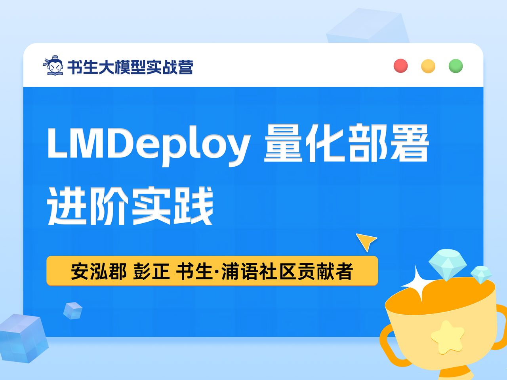

# 3.3 LMDeploy 量化部署进阶实践



## 一、任务说明

### 1.基础任务

- 使用结合W4A16量化与kv cache量化的internlm2_5-7b-chat模型封装本地API并与大模型进行一次对话，作业截图需包括显存占用情况与大模型回复，参考4.1 API开发(优秀学员必做)

- 使用Function call功能让大模型完成一次简单的"加"与"乘"函数调用，作业截图需包括大模型回复的工具调用情况，参考4.2 Function call(选做)

### 2.进阶任务


## 二、任务提交

### 基础任务

- W4A16量化与kv cache量化的internlm2_5-7b-chat显存占用情况与大模型回复

- Function call功能让大模型完成一次简单的"加"与"乘"函数调用,大模型回复的工具调用情况

### 进阶任务

## 三、复现步骤

1. LMDeploy环境
2. LMDeploy与InternLM2.5
3. LMDeploy与InternVL2
4. LMDeploy的api服务与Function call

### 3.1 LMDeploy环境

- 开发及设置

30%A100*1(24GB显存容量)

```shell
conda create -n lmdeploy  python=3.10 -y
conda activate lmdeploy
conda install pytorch==2.1.2 torchvision==0.16.2 torchaudio==2.1.2 pytorch-cuda=12.1 -c pytorch -c nvidia -y
pip install timm==1.0.8 openai==1.40.3 lmdeploy[all]==0.5.3
```

