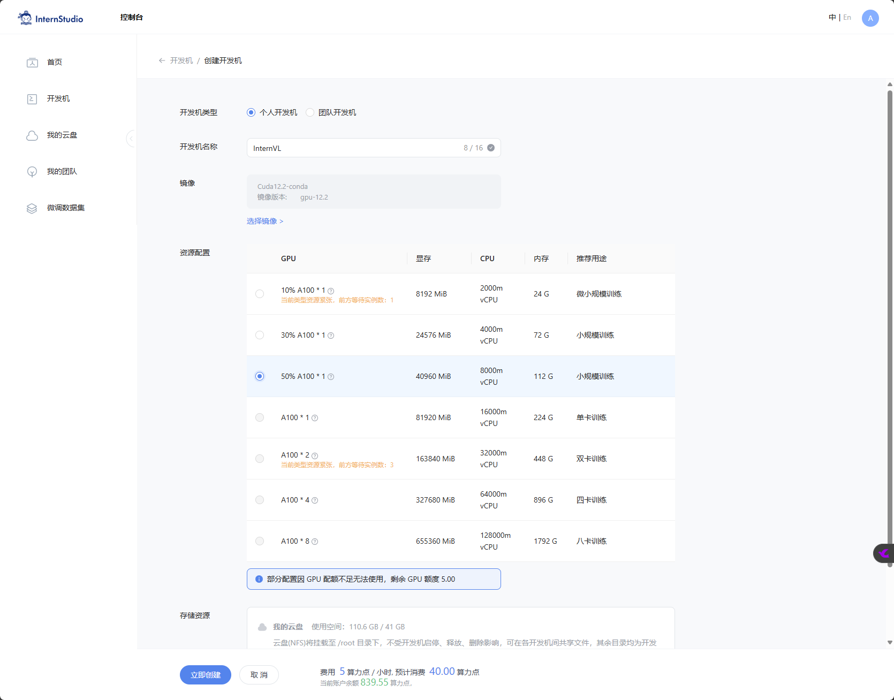
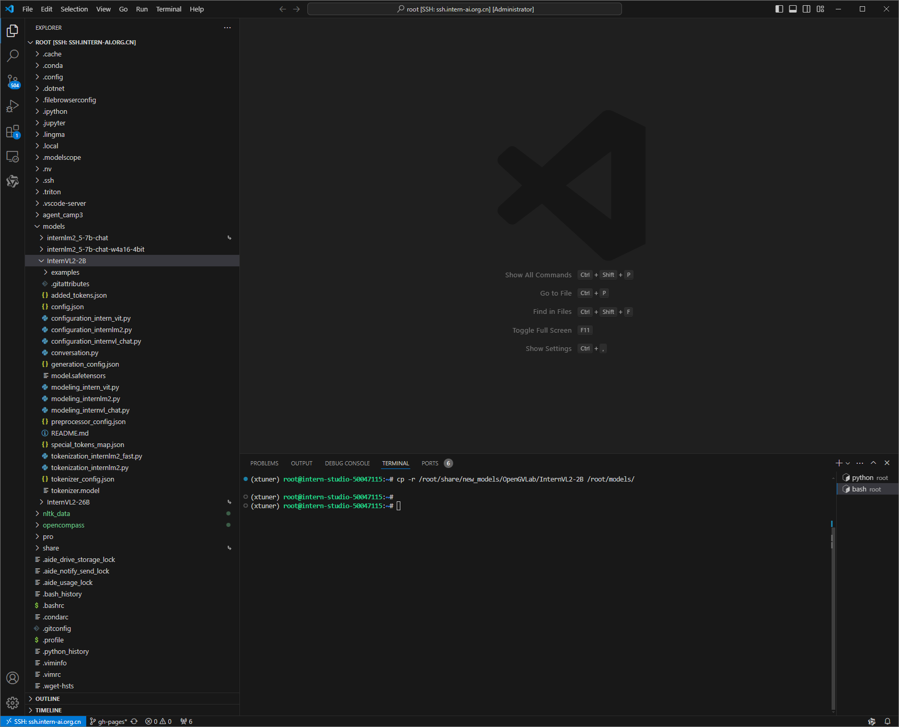
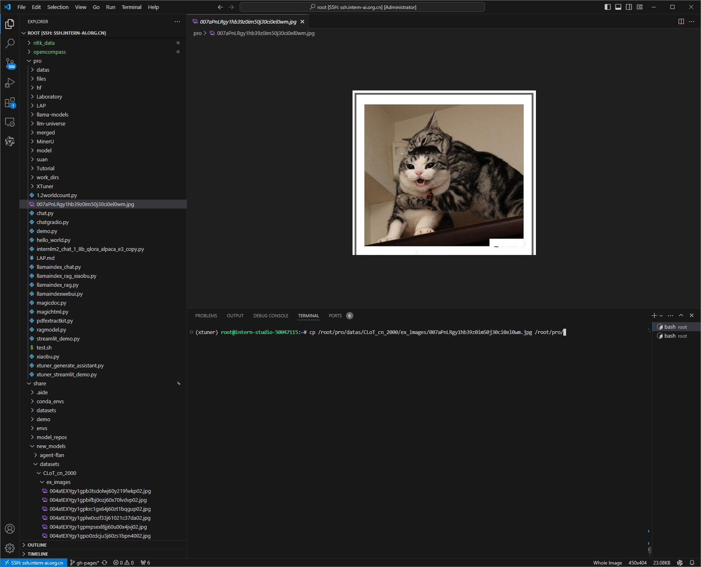
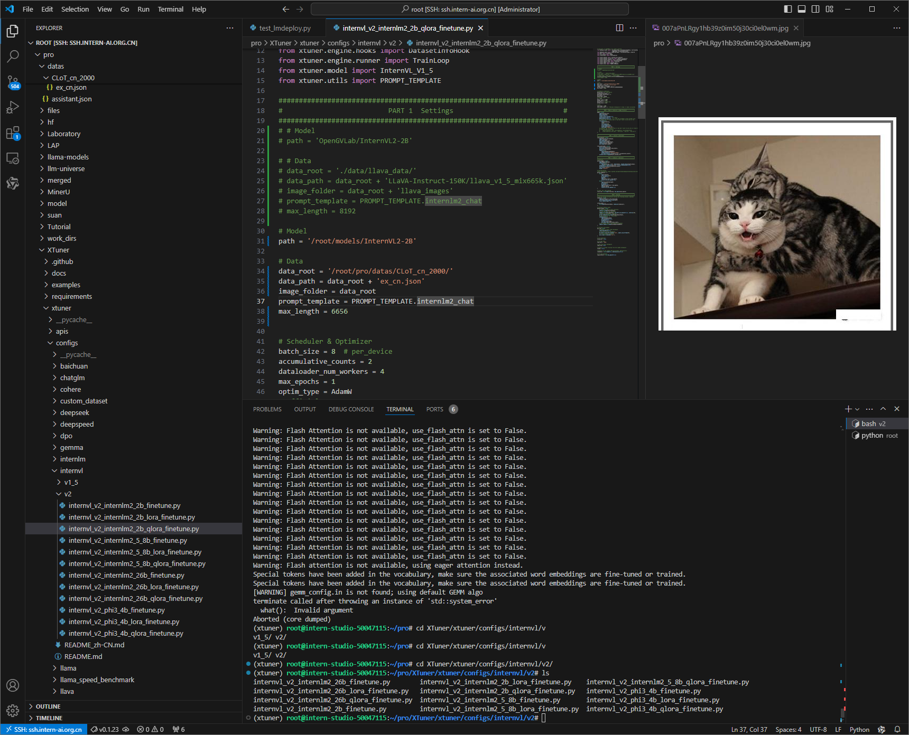

# 3.4 InternVL 多模态模型部署微调实践


## 一、任务说明

### 1.基础任务
- follow 教学文档和视频使用QLoRA进行微调模型，复现微调效果，并能成功讲出梗图.

- 尝试使用LoRA，或调整xtuner的config，如LoRA rank，学习率。看模型Loss会如何变化，并记录调整后效果(选做，使用LoRA或调整config可以二选一)

### 2.进阶任务

- 复现图梗

- LoRA微调

## 二、任务提交

### 基础任务

### 进阶任务

## 三、复现步骤

- Step1：开发机创建



- Step2: InternVL2-2B 模型获取

```shell

cd /root
mkdir -p models

cp 模型

cp -r /root/share/new_models/OpenGVLab/InternVL2-2B /root/models/

```


- Step3: 依赖库安装

```shell

conda create --name xtuner python=3.10 -y

# 激活虚拟环境（注意：后续的所有操作都需要在这个虚拟环境中进行）
conda activate xtuner

# 安装一些必要的库
conda install pytorch==2.1.2 torchvision==0.16.2 torchaudio==2.1.2 pytorch-cuda=12.1 -c pytorch -c nvidia -y
# 安装其他依赖
apt install libaio-dev
pip install transformers==4.39.3
pip install streamlit==1.36.0
pip install lmdeploy==0.5.3

```

- Step4: 获取数据

```shell

## 首先让我们安装一下需要的包
pip install datasets matplotlib Pillow timm

## 让我们把数据集挪出来
cp -r /root/share/new_models/datasets/CLoT_cn_2000 /root/pro/datas/

```

- Step5: InternVL2-2B 单图推理


```shell
## 获取单图

cp /root/pro/datas/CLoT_cn_2000/ex_images/007aPnLRgy1hb39z0im50j30ci0el0wm.jpg /root/pro/

```



```shell

##创建代码测试
touch /root/pro/test_lmdeploy.py
cd /root/pro/
```

```python
from lmdeploy import pipeline
from lmdeploy.vl import load_image

pipe = pipeline('/root/model/InternVL2-2B')

image = load_image('/root/InternLM/007aPnLRgy1hb39z0im50j30ci0el0wm.jpg')
response = pipe(('请你根据这张图片，讲一个脑洞大开的梗', image))
print(response.text)
```

- Step6: 模型微调设置

```shell
##配置微调参数

## 修改：XTuner/xtuner/configs/internvl/v2/internvl_v2_internlm2_2b_qlora_finetune.py中的Model和data

```

```python
#######################################################################
#                          PART 1  Settings                           #
#######################################################################
# Model
path = '/root/models/InternVL2-2B'

# Data
data_root = '/root/pro/datas/CLoT_cn_2000/'
data_path = data_root + 'ex_cn.json'
image_folder = data_root
prompt_template = PROMPT_TEMPLATE.internlm2_chat
max_length = 6656

```




- Step7: 开始训练

```shell
NPROC_PER_NODE=1 xtuner train /root/pro/XTuner/xtuner/configs/internvl/v2/internvl_v2_internlm2_2b_qlora_finetune.py  --work-dir /root/pro/work_dirs/internvl_ft_run_8_filter  --deepspeed deepspeed_zero1
```

- Step8: 合并权重&&模型转换

```shell
python3 /root/XTuner/xtuner/configs/internvl/v1_5/convert_to_official.py /root/XTuner/xtuner/configs/internvl/v2/internvl_v2_internlm2_5_8b_qlora_finetune.py /root/work_dirs/internvl_ft_run_8_filter/iter_3000.pth /root/models/InternVL2-2B-qlora/
```